# RAGDemo

基于 LangChain4j 框架实现的 RAG（Retrieval-Augmented Generation）智能问答系统。

## 技术栈

| 层级 | 技术 |
|------|------|
| **后端框架** | Spring Boot 3.2.4 (Java 17) |
| **AI/LLM框架** | LangChain4j 0.36.0 |
| **向量数据库** | Milvus 2.6.6 |
| **全文搜索引擎** | Elasticsearch 8.15.0 |
| **消息队列** | Apache Kafka 3.7.0 |
| **对象存储** | MinIO (S3兼容) |
| **关系数据库** | MySQL 8.4.0 |
| **缓存/会话** | Redis 7 |
| **文档解析** | Apache Tika 2.9.2 |
| **安全认证** | Spring Security + JWT (jjwt 0.12.5) |

## 系统架构

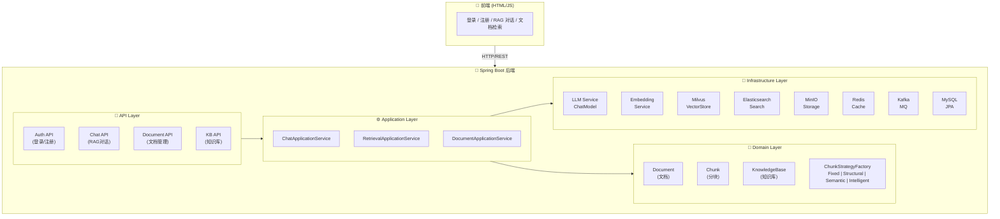

## 核心流程

### 1. 文档处理流水线

文档从上传到可检索需要经过以下阶段，全程异步处理：

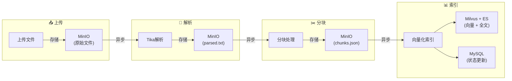

**Kafka Topics：**
- `document-upload` - 原始文档事件
- `document-parsed` - 分块完成事件
- `document-chunked` - 索引完成事件

**各阶段职责：**

| 阶段 | 服务 | 技术 | 输出 |
|------|------|------|------|
| 上传 | DocumentApplicationService | MinIO SDK | 原始文件存储 |
| 解析 | ParseService | Apache Tika | 提取文本 + MIME类型 |
| 分块 | ChunkService | 多种策略 | chunks.json |
| 索引 | IndexService | Embedding + Milvus + ES | 向量 + 全文索引 |

### 2. RAG 对话流程

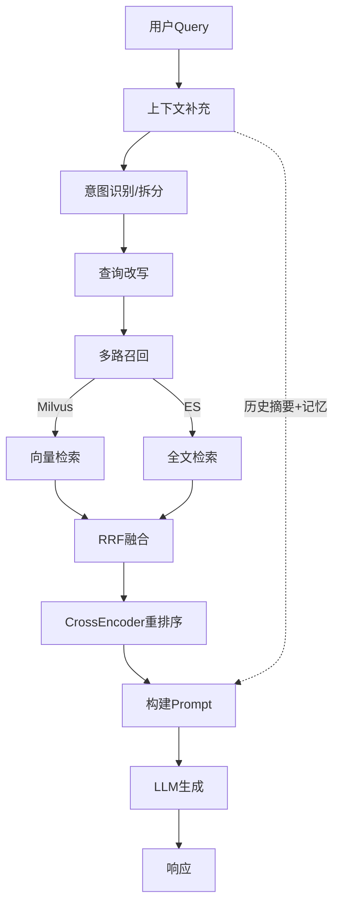

**对话处理关键步骤：**

1. **上下文补充 (Context Enrichment)**
   - 加载对话历史摘要
   - 补充最近 N 轮对话上下文
   - 构建多轮对话的完整语境

2. **意图识别与拆分 (Intent Recognition & Task Decomposition)**
   - LLM 分析用户问题的真实意图
   - 将复杂问题拆分为多个子问题
   - 判断是否需要多跳推理

3. **查询改写 (Query Rewrite)**
   - 使用 LLM 将原始问题改写为多个查询表达式
   - 捕捉不同角度的搜索意图
   - 包含同义词扩展、语义扩展

4. **多路召回 (Multi-Query Retrieval)**
   - 并行执行向量检索 (Milvus)
   - 并行执行全文检索 (Elasticsearch)
   - 每个子问题独立召回

5. **结果融合 (RRF - Reciprocal Rank Fusion)**
   - 使用 RRF 算法融合多路检索结果
   - Score = Σ 1/(k + rank_i)
   - 解决不同检索器结果差异问题

6. **重排序 (Reranking)**
   - 使用 CrossEncoder 对融合结果精排
   - 考虑语义相关性而非只是词频
   - 返回 TopK 最终结果

7. **Prompt 构建**
   - 系统指令 + 对话历史 + 检索上下文 + 当前问题
   - 格式化为结构化 Prompt
   - 包含引用来源标记

### 3. 分块策略

| 策略 | 适用场景 | 说明 |
|------|----------|------|
| **fixed** | 通用场景 | 固定字符数分块 + 智能单词边界切分 |
| **structural** | 结构化文档 | 基于段落/标题/列表等结构分块 |
| **semantic** | 长文档 | 基于语义相似度自动划分 |
| **intelligent** | 混合文档 | 根据 MIME 类型自动选择最优策略 |

**智能分块决策树：**

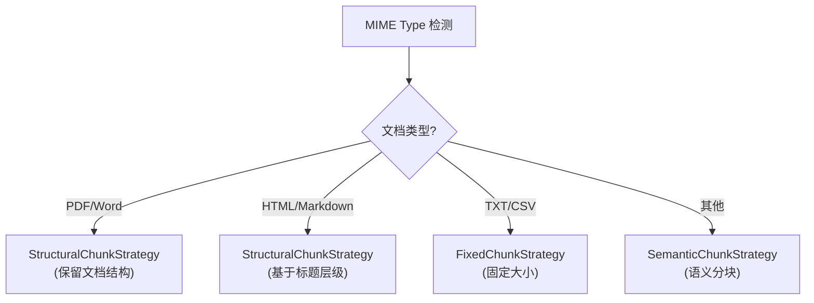

## 五存储系统

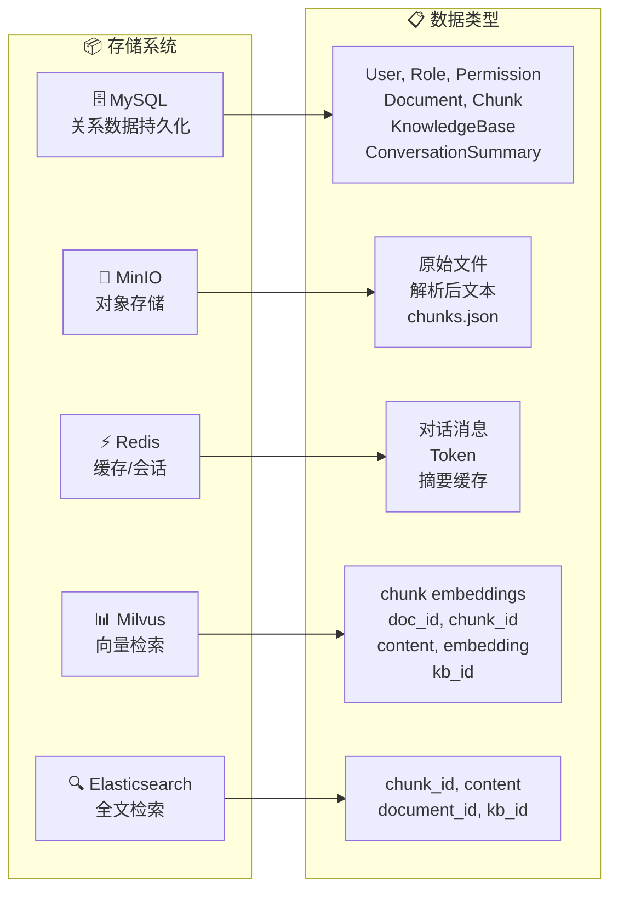

| 存储 | 用途 | 数据类型 |
|------|------|----------|
| **MySQL** | 关系数据持久化 | User, Role, Permission, Document, Chunk, KnowledgeBase, ConversationSummary |
| **MinIO** | 对象存储 | 原始文件, 解析后文本, chunks.json |
| **Redis** | 缓存/会话 | 对话消息, Token, 摘要缓存 |
| **Milvus** | 向量检索 | chunk embeddings (doc_id, chunk_id, content, embedding, kb_id) |
| **Elasticsearch** | 全文检索 | chunk_id, content, document_id, kb_id (text字段) |

## 数据模型

### Document (文档)

```json
{
  "id": "uuid",
  "kbId": "knowledge-base-id",
  "fileName": "document.pdf",
  "mimeType": "application/pdf",
  "status": "PENDING | UPLOADED | PARSING | PARSED | CHUNKING | CHUNKED | INDEXING | INDEXED | FAILED",
  "metadata": {
    "size": 1024000,
    "pages": 10,
    "chunkStrategy": "fixed"
  },
  "createdAt": "2024-01-01T00:00:00Z",
  "updatedAt": "2024-01-01T00:00:00Z"
}
```

### Chunk (分块)

```json
{
  "id": "uuid",
  "documentId": "document-uuid",
  "kbId": "knowledge-base-id",
  "content": "这是分块的具体文本内容...",
  "index": 0,
  "metadata": {
    "chunkStrategy": "fixed",
    "chunkSize": 512
  }
}
```

### KnowledgeBase (知识库)

```json
{
  "id": "uuid",
  "name": "产品文档库",
  "description": "公司产品相关文档",
  "ownerId": "user-uuid",
  "documentCount": 25,
  "embeddingModel": "BAAI/bge-m3",
  "chunkStrategy": "fixed",
  "createdAt": "2024-01-01T00:00:00Z"
}
```

## API 接口

### 认证接口

| 接口 | 方法 | 说明 |
|------|------|------|
| `/api/v1/auth/register` | POST | 用户注册 |
| `/api/v1/auth/login` | POST | 用户登录，返回 JWT Token |
| `/api/v1/auth/refresh` | POST | 刷新 Token |

### 知识库接口

| 接口 | 方法 | 说明 |
|------|------|------|
| `/api/v1/kbs` | POST | 创建知识库 |
| `/api/v1/kbs` | GET | 获取知识库列表 |
| `/api/v1/kbs/{id}` | GET | 获取知识库详情 |
| `/api/v1/kbs/{id}` | PUT | 更新知识库 |
| `/api/v1/kbs/{id}` | DELETE | 删除知识库 |

### 文档接口

| 接口 | 方法 | 说明 |
|------|------|------|
| `/api/v1/documents/upload` | POST | 上传文档 |
| `/api/v1/documents` | GET | 获取文档列表 |
| `/api/v1/documents/{id}` | GET | 获取文档详情 |
| `/api/v1/documents/{id}` | DELETE | 删除文档 |
| `/api/v1/documents/{id}/status` | GET | 获取文档处理状态 |

### 对话接口

| 接口 | 方法 | 说明 |
|------|------|------|
| `/api/v1/chat` | POST | RAG 对话问答 |
| `/api/v1/chat/history/{conversationId}` | GET | 获取对话历史 |
| `/api/v1/chat/history/{conversationId}` | DELETE | 删除会话 |

### 检索接口

| 接口 | 方法 | 说明 |
|------|------|------|
| `/api/v1/retrieve` | POST | 文档检索 |

### 评估接口

| 接口 | 方法 | 说明 |
|------|------|------|
| `/api/v1/evaluation/ragas` | POST | RAGAS评估 |

## 配置说明

所有配置通过 `config.yaml` 管理：

```yaml
# ============ 服务配置 =============
app:
  host: 0.0.0.0
  port: 18081

# ============ LLM 配置 =============
llm:
  provider: minimax          # LLM 提供商 (minimax/openai)
  api-key: your-api-key
  model: MiniMax-M2.7
  base-url: https://api.minimax.chat/v1
  group-id: your-group-id   # MiniMax 专用

# ============ Embedding 配置 =============
embedding:
  model: BAAI/bge-m3
  dimension: 1024
  base-url: https://api.siliconflow.cn/v1
  api-key: your-api-key

# ============ Reranker 配置 =============
reranker:
  model: BAAI/bge-reranker-v2-m3

# ============ 向量数据库 (Milvus) =============
milvus:
  uri: http://localhost:19531
  collection: rag_chunks

# ============ 全文检索 (Elasticsearch) =============
elasticsearch:
  host: localhost
  port: 9201
  index: rag_documents

# ============ 消息队列 (Kafka) =============
kafka:
  bootstrap-servers: localhost:9092
  consumer:
    group-id: rag-system
  topics:
    document-upload: document-upload
    document-parsed: document-parsed
    document-chunked: document-chunked

# ============ 关系数据库 (MySQL) =============
mysql:
  host: localhost
  port: 3306
  database: rag_system
  username: root
  password: password

# ============ 缓存 (Redis) =============
redis:
  host: localhost
  port: 6380
  password: ""

# ============ 对象存储 (MinIO) =============
minio:
  endpoint: http://localhost:9001
  access-key: minioadmin
  secret-key: minioadmin
  bucket: rag-documents

# ============ 分块配置 =============
chunking:
  chunk-size: 512
  chunk-overlap: 50

# ============ 记忆配置 =============
memory:
  window-size: 10
  summary-threshold: 8
  ttl-days: 7
```

## 运行

### 环境要求

- Java 17+
- Maven 3.8+
- MySQL 8.0+
- Redis 7+
- Milvus 2.6+
- Elasticsearch 8.15+
- Kafka 3.7+
- MinIO

### 启动服务

```bash
# 编译项目
mvn clean package -DskipTests

# 启动后端 (使用 config.yaml)
mvn spring-boot:run -DskipTests

# 或指定配置文件
mvn spring-boot:run -DskipTests -Dspring-boot.run.arguments="--spring.config.additional-location=file:./config.yaml"
```

### Docker 基础设施

```bash
# 启动所有中间件服务
docker-compose up -d
```

### 默认账号

- 用户名：`admin`
- 密码：`admin123`

### 访问地址

- 后端 API：`http://localhost:18081`
- 前端页面：`http://localhost:18081/index.html`

## 项目结构

```
src/main/java/com/rag/
├── api/rest/                    # REST API Controllers
│   ├── auth/                    # 认证接口 (登录/注册/刷新Token)
│   ├── chat/                    # 聊天接口
│   ├── document/                # 文档管理接口
│   ├── kb/                      # 知识库管理接口
│   ├── retrieval/               # 检索接口
│   └── evaluation/              # 评估接口
│
├── application/                 # 应用服务层 (用例编排)
│   ├── chat/                    # 聊天服务
│   │   ├── ChatApplicationService.java
│   │   ├── IntentClassifier.java
│   │   ├── MemoryService.java
│   │   └── QueryRewriter.java
│   ├── document/                # 文档服务
│   │   └── DocumentApplicationService.java
│   ├── retrieval/               # 检索服务
│   │   ├── RetrievalApplicationService.java
│   │   └── HybridRetrievalService.java
│   └── evaluation/              # 评估服务
│       └── RAGASEvaluator.java
│
├── domain/                      # 领域模型层
│   ├── model/                   # 实体类
│   │   ├── User.java
│   │   ├── Role.java
│   │   ├── Permission.java
│   │   ├── Document.java
│   │   ├── Chunk.java
│   │   ├── KnowledgeBase.java
│   │   └── ConversationSummary.java
│   ├── repository/              # 仓储接口 (JPA)
│   ├── event/                   # 领域事件
│   │   └── DocumentEvent.java
│   └── chunking/                # 分块策略
│       ├── ChunkStrategy.java   # 策略接口
│       ├── ChunkStrategyFactory.java
│       ├── FixedChunkStrategy.java
│       ├── StructuralChunkStrategy.java
│       ├── SemanticChunkStrategy.java
│       └── IntelligentChunkingStrategy.java
│
├── infrastructure/              # 基础设施层
│   ├── llm/                    # LLM 服务
│   │   ├── ChatModelService.java
│   │   ├── EmbeddingService.java
│   │   └── CrossEncoderReranker.java
│   ├── vector/                 # 向量存储 (Milvus)
│   │   └── MilvusVectorStore.java
│   ├── search/                 # 全文搜索 (Elasticsearch)
│   │   ├── ElasticsearchSearch.java
│   │   └── ElasticsearchConfig.java
│   ├── storage/                # 对象存储 (MinIO)
│   │   └── MinioStorage.java
│   ├── mq/                     # 消息队列 (Kafka)
│   │   ├── KafkaConfig.java
│   │   ├── KafkaTopics.java
│   │   ├── DocumentEventProducer.java
│   │   ├── ParseService.java   # 文档解析
│   │   ├── ChunkService.java   # 分块处理
│   │   └── IndexService.java   # 向量索引
│   ├── redis/                  # Redis 缓存
│   │   └── RedisConfig.java
│   └── security/               # 安全认证
│       ├── SecurityConfig.java
│       ├── JwtAuthenticationFilter.java
│       ├── JwtUtils.java
│       └── DataInitializer.java
│
└── config/                     # 配置类
    └── AppConfig.java
```

## 核心特性详解

### 1. 知识库构建过程优化

**问题痛点**：传统同步编排流程中，长耗时文档（如 100+ 页 PDF）解析会导致 API 超时，系统吞吐量受限。

**解决方案**：将同步编排流程重构为基于 Kafka 的异步解耦流水线，实现全链路异步化。

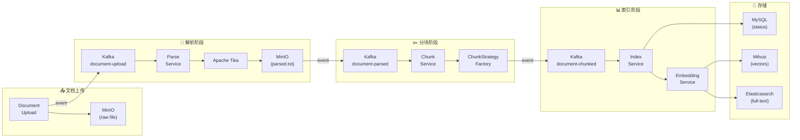

**技术价值**：
- 利用 MQ 的削峰填谷特性，平滑处理突发文档上传
- 各阶段独立扩展，解耦严重程度不同的处理耗时
- API 立即返回，避免长时间等待
- 支持失败重试和死信队列

### 2. 双路召回与精排优化

**问题痛点**：单一检索方式（仅向量或仅全文）难以覆盖所有查询类型，导致召回率不足。

**解决方案**：构建 "ES（BM25关键词）+ Milvus（稠密向量）" 混合检索架构。

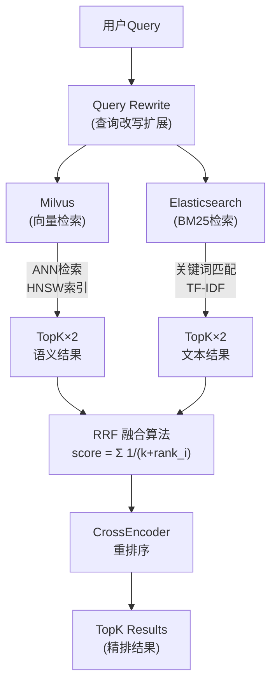

**RRF 融合公式**：

$$Score_{RRF} = \sum_{i=1}^{N} \frac{1}{k + rank_i(d)}$$

其中：
- $N$ = 检索路径数量（如 ES + Milvus = 2）
- $k$ = 融合参数（通常设为 60）
- $rank_i(d)$ = 文档 $d$ 在第 $i$ 路检索中的排名

**效果指标**：
- Recall@10 相比单路召回提升 **18%**
- MRR@10 提升 **15%**

### 3. 智能会话记忆与成本控制

**问题痛点**：长对话场景下，Token 数量随对话轮数线性增长，导致：
- 超出模型上下文窗口限制
- Token 成本急剧上升
- 检索质量下降（上下文稀释）

**解决方案**：滑动窗口 + 自动摘要 + TTL 过期策略

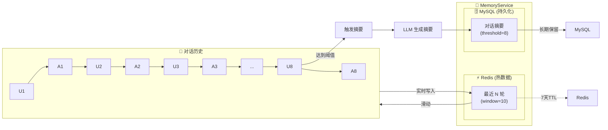

**工作流程**：

1. **滑动窗口保留**：仅保留最近 N 轮对话（可配置，默认 10 轮）
2. **阈值触发摘要**：当对话轮数达到阈值（默认 8 轮）时：
   - 调用 LLM 生成对话摘要
   - 持久化至 MySQL
   - 清空 Redis 热数据，保留摘要标记
3. **TTL 自动过期**：
   - Redis 缓存 7 天过期
   - MySQL 摘要长期保留
4. **上下文重建**：加载对话时，自动组装摘要 + 最近消息

**效果**：
- Token 成本降低 **60%**（长对话场景）
- 保持关键上下文信息不丢失
- 避免 Token 爆炸问题

### 4. 统一语义理解与动态路由

**问题痛点**：
- 用户问题表述多样，传统关键词匹配难以捕捉真实意图
- 复杂问题需要多跳推理，单一检索无法满足
- 知识库众多时，全量检索效率低下

**解决方案**：基于 LLM 实现意图识别 + 知识库动态路由 + 查询改写

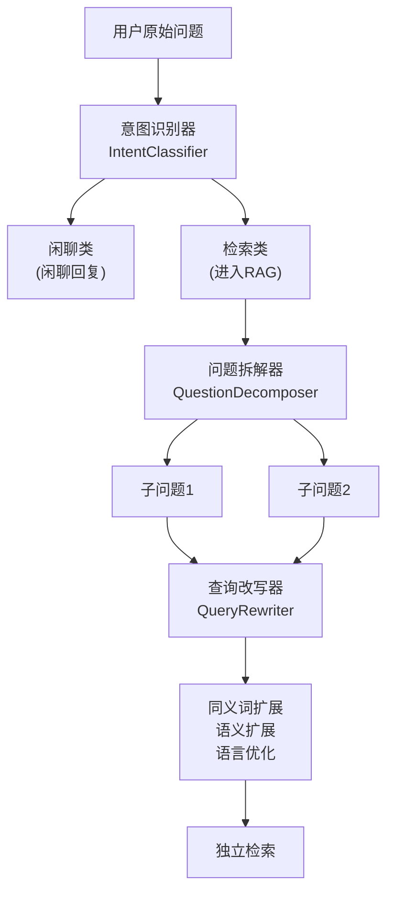

**意图分类**：

| 意图类型 | 处理策略 | 说明 |
|----------|----------|------|
| **KNOWLEDGE_QA** | RAG 检索 | 需要知识库回答的事实性问题 |
| **CHIT_CHAT** | 闲聊回复 | 不需要检索的闲聊 |
| **PRECISE_SEARCH** | RAG 检索 | 精确信息查找请求 |
| **SUMMARY** | 摘要请求 | 使用记忆上下文 |
| **UNKNOWN** | 根据置信度决定 | 无法分类 |

**置信度机制**：

```python
if confidence < threshold:
    return {
        "type": "clarification",
        "message": "您是想了解...方面的内容吗？",
        "suggestions": ["A", "B", "C"]
    }
```

### 5. 分布式队列限流

**问题痛点**：多用户并发调用 LLM API 时：
- 触发 API 速率限制（Rate Limit）
- 成本不可控
- 响应时间波动大

**解决方案**：基于 Redis 实现分布式限流 + 公平排队 + SSE 实时推送

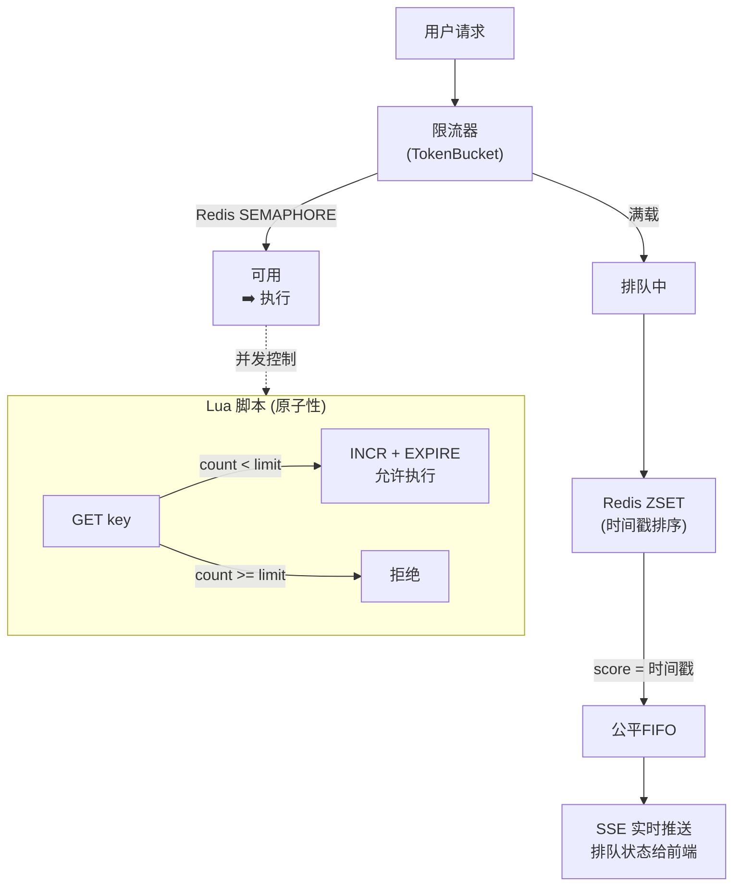

**限流策略**：

1. **信号量限流**：控制同时执行的请求数
   ```lua
   -- Lua 脚本保证原子性
   local count = redis.call('GET', key) or 0
   if count < limit then
       redis.call('INCR', key)
       redis.call('EXPIRE', key, ttl)
       return 1  -- 允许执行
   end
   return 0  -- 拒绝
   ```

2. **公平排队**：ZSET 按时间戳排序，确保 FIFO
3. **超时拒绝**：排队超时自动拒绝，释放资源
4. **SSE 推送**：实时推送排队位置和预计等待时间

**效果**：
- 控制模型调用并发，避免 Rate Limit
- 多用户公平使用 API 配额
- 前端实时感知排队状态，优化用户体验

## 安全机制

### RBAC 权限控制

- **ADMIN** - 管理员，拥有所有权限
- **USER** - 普通用户，拥有基础读写权限

### JWT 认证

- Access Token：用于 API 认证
- Refresh Token：用于刷新 Access Token
- Token 过期时间：24小时

### 接口权限

| 接口 | ADMIN | USER |
|------|-------|------|
| 知识库管理 | ✓ | ✓ (仅自己的) |
| 文档上传 | ✓ | ✓ |
| 文档删除 | ✓ | ✓ (自己的) |
| 对话问答 | ✓ | ✓ |

## RAG 系统评测

### 评测框架：RAGAS

[RAGAS](https://github.com/explodinggradients/ragas) (Retrieval Augmented Generation Assessment) 是一个专为 RAG 系统设计的自动化评测框架，提供多维度指标评估检索和生成质量。

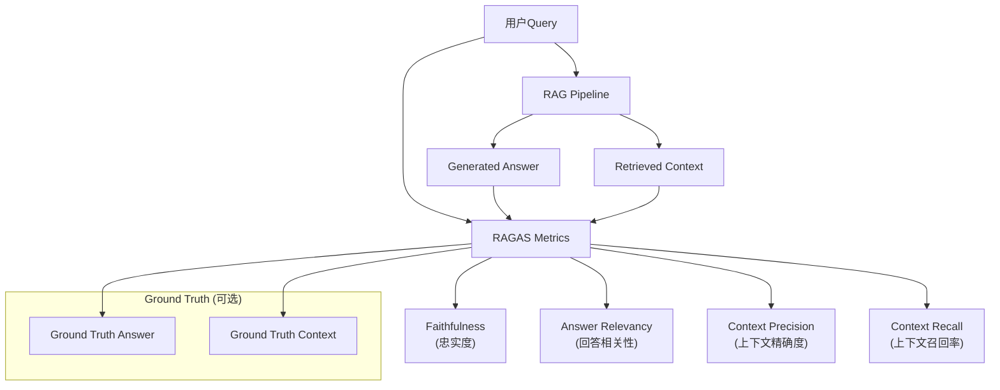

### 评测指标体系

#### 1. 检索阶段指标 (Retrieval Metrics)

| 指标 | 说明 | 公式/描述 |
|------|------|-----------|
| **context_precision** | 上下文块排序质量 | 相关块在上下文中的位置权重 |
| **context_relevancy** | 上下文相关性 | 检索到的块与问题的语义相关度 |
| **context_recall** | 上下文召回率 | 检索到的信息覆盖 Ground Truth 的比例 |
| **context_entity_match** | 实体召回率 | 关键实体在上下文中的召回程度 |

#### 2. 生成阶段指标 (Generation Metrics)

| 指标 | 说明 | 公式/描述 |
|------|------|-----------|
| **faithfulness** | 忠实度 | 生成答案对检索上下文的事实一致性 |
| **answer_relevancy** | 回答相关性 | 回答与原始问题的语义相关度 |
| **answer_correctness** | 回答正确性 | 回答与 Ground Truth 的匹配程度 |
| **answer_similarity** | 回答相似度 | 回答与 Ground Truth 的语义相似度 |

#### 3. 端到端指标 (End-to-End Metrics)

| 指标 | 说明 |
|------|------|
| **ragas_score** | 综合 RAG 性能评分 |
| **response_latency** | 端到端响应延迟 |
| **retrieval_latency** | 检索阶段延迟 |
| **generation_latency** | 生成阶段延迟 |

### RAGAS 核心公式

**Faithfulness（忠实度）**：

$$ faithfulness = \frac{|SU(answer) \cap S(context)|}{|SU(answer)|} $$

其中 $SU(answer)$ 是答案中的陈述集合，$S(context)$ 是上下文中支持的事实集合。

**Answer Relevancy（回答相关性）**：

$$ answer\_relevancy = \frac{1}{n} \sum_{i=1}^{n} \frac{sim(q, q_i')}{n} $$

其中 $q_i'$ 是从回答中推断出的子问题，$sim$ 是余弦相似度。

### 评测流程

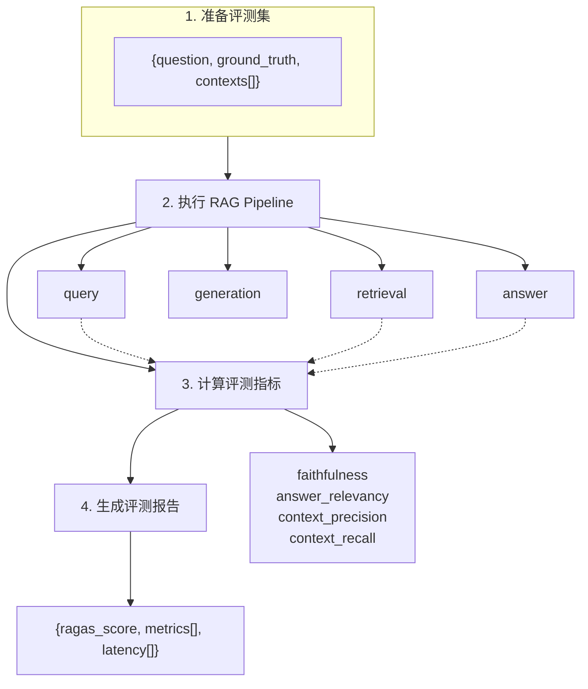

### RAGAS 配置示例

```python
from ragas import evaluate
from ragas.metrics import (
    faithfulness,
    answer_relevancy,
    context_precision,
    context_recall,
)

# 定义评测数据集
eval_dataset = [
    {
        "question": "RAG 系统是什么？",
        "ground_truth": "RAG 是检索增强生成，通过检索外部知识来增强 LLM 的生成能力。",
        "answer": "RAG 是检索增强生成（Retrieval-Augmented Generation）的缩写...",
        "contexts": [
            "RAG 是一种结合检索和生成的技术...",
            "它通过从外部知识库检索相关信息..."
        ]
    }
]

# 执行评测
result = evaluate(
    eval_dataset,
    metrics=[
        faithfulness,           # 忠实度
        answer_relevancy,      # 回答相关性
        context_precision,     # 上下文精确度
        context_recall,        # 上下文召回率
    ]
)

# 查看结果
print(result)
```

### 评测结果解读

| 指标范围 | 评价 | 建议 |
|----------|------|------|
| **0.8 - 1.0** | 优秀 | RAG 系统在该维度表现良好 |
| **0.6 - 0.8** | 良好 | 有改进空间，可针对性优化 |
| **0.4 - 0.6** | 一般 | 需要重点优化该维度 |
| **< 0.4** | 较差 | 存在严重问题，需重构 |

### 评测维度与优化方向对照

| 低分指标 | 可能原因 | 优化方向 |
|----------|----------|----------|
| context_precision | 检索排序不合理 | 优化 RRF 融合或重排 |
| context_recall | 召回不足 | 优化查询改写或多路召回 |
| faithfulness | 幻觉严重 | 优化 Prompt 或降低 Temperature |
| answer_relevancy | 答非所问 | 优化意图识别或检索相关性 |
| answer_correctness | 回答错误 | 优化生成质量或检索召回 |
