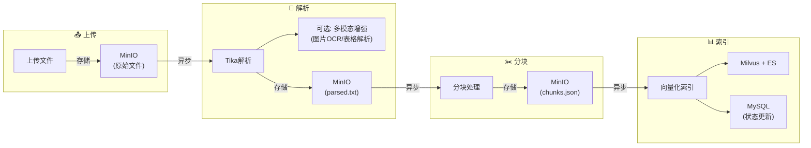
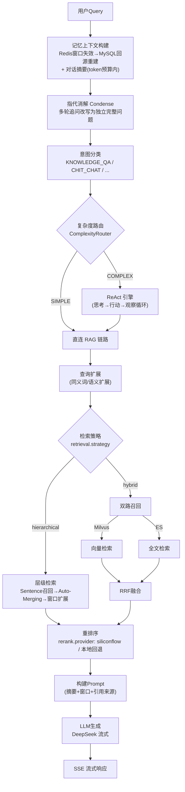
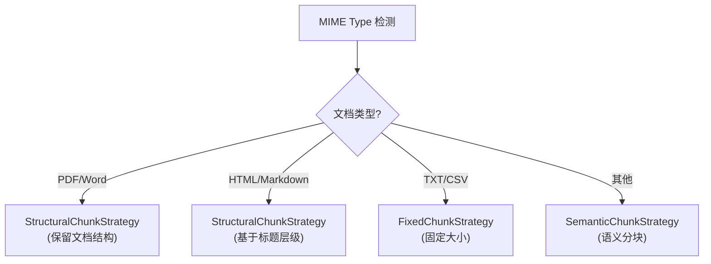
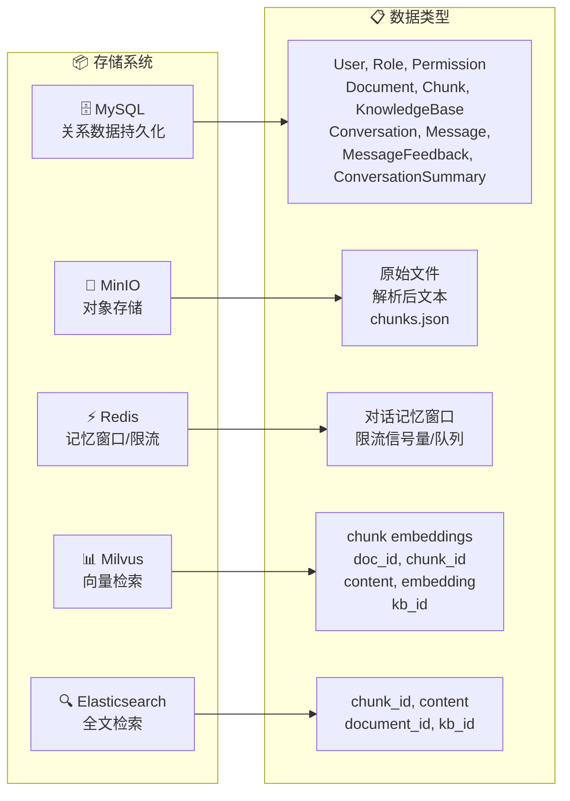
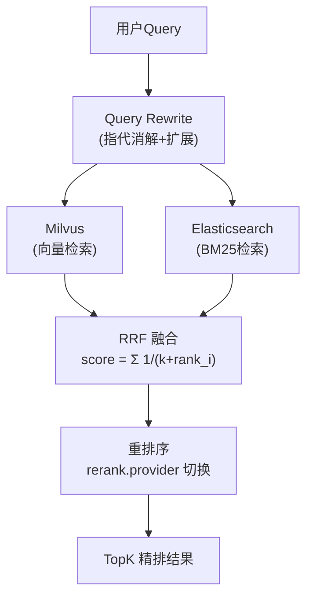
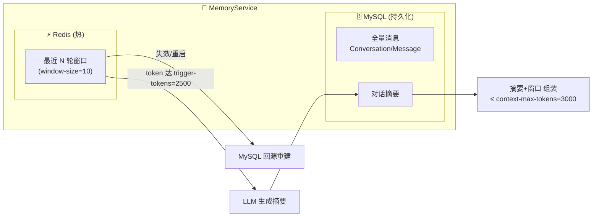
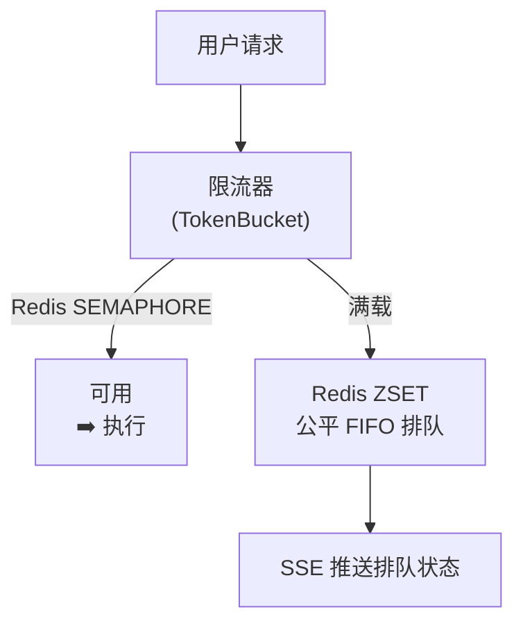
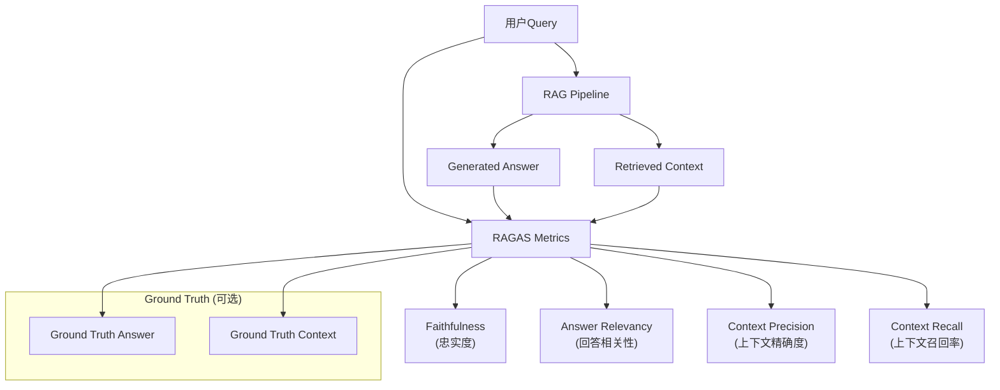
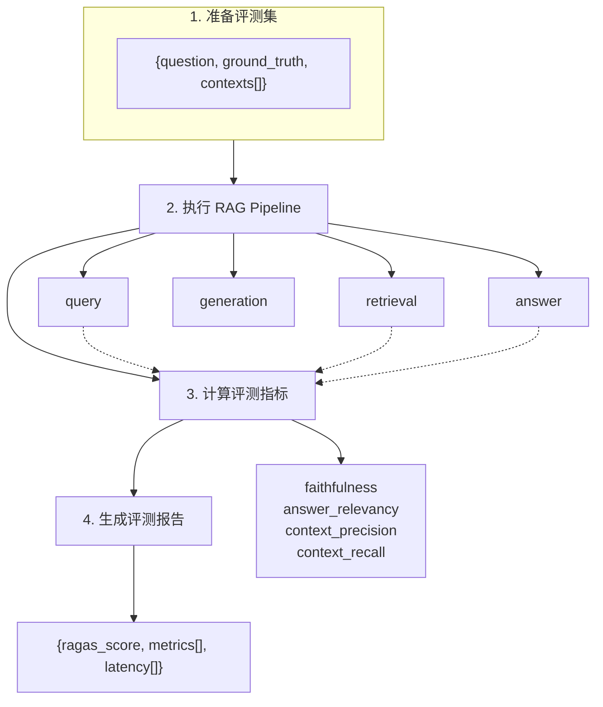

# RAGGG (RAGDemo)

基于 Spring Boot 3 + LangChain4j 实现的 RAG（Retrieval-Augmented Generation）智能问答系统：Kafka 异步文档流水线、混合检索 + 双路精排、层级化分块检索（Sentence Window + Auto-Merging）、ReAct 复杂问题推理引擎、Redis/MySQL 两级会话记忆、SSE 流式输出与完整的可观测性体系。

## 技术栈

| 层级 | 技术 |
|------|------|
| **后端框架** | Spring Boot 3.2.4 (Java 17) |
| **AI/LLM框架** | LangChain4j 0.36.0 |
| **LLM 提供方** | DeepSeek（主，deepseek-chat 流式）· MiniMax（兼容保留）· Ollama（本地） |
| **Embedding** | BAAI/bge-m3（SiliconFlow API / Ollama 本地批量 `/api/embed`） |
| **重排序** | BAAI/bge-reranker-v2-m3（SiliconFlow CrossEncoder API / 本地 Bi-Encoder 回退） |
| **向量数据库** | Milvus 2.6.6 |
| **全文搜索引擎** | Elasticsearch 8.15.0 |
| **消息队列** | Apache Kafka 3.7.0 |
| **对象存储** | MinIO (S3兼容) |
| **关系数据库** | MySQL 8.0（会话/消息/摘要持久化） |
| **缓存/会话** | Redis 7（记忆窗口 + 分布式限流） |
| **文档解析** | Apache Tika 2.9.2（可选：阿里云 OCR + 表格解析增强） |
| **安全认证** | Spring Security + JWT (jjwt 0.12.5) |
| **可观测性** | Micrometer + Prometheus + Grafana（预置面板）· OpenTelemetry（可选，`otel.enabled`） |

## 系统架构

```mermaid
flowchart TB
    subgraph Frontend["👤 前端 (静态打包 SPA)"]
        UI["登录 / RAG 对话(流式) / 文档管理 / 会话管理 / 反馈"]
    end

    subgraph Backend["🚀 Spring Boot 后端"]
        subgraph API["🎯 API Layer"]
            AuthAPI["Auth API<br/>(注册/登录/刷新/登出)"]
            ChatAPI["Chat API<br/>(同步 + SSE/NDJSON 流式)"]
            RagV3["RAG v3 API<br/>(SSE 流式 + 停止 + Trace)"]
            VisionAPI["Vision API<br/>(图像理解/多模态对话)"]
            ConvAPI["Conversation API<br/>(会话/消息/反馈)"]
            DocAPI["Document / Ingestion API"]
            KBAPI["KnowledgeBase API"]
            RetAPI["Retrieval / Evaluation API"]
        end

        subgraph Application["⚙️ Application Layer"]
            ChatAS["ChatApplicationService<br/>(记忆→指代消解→检索→生成)"]
            React["ReAct 引擎<br/>ComplexityRouter·ActionExecutor<br/>LoopDetector·ActionCache"]
            Memory["MemoryService<br/>(Redis窗口+MySQL回源+摘要)"]
            Rewriter["QueryRewriter<br/>(指代消解+查询扩展)"]
            RetrievalAS["RetrievalApplicationService<br/>(策略路由+双Reranker+指标)"]
            Hybrid["HybridRetrievalService<br/>(双路召回+RRF)"]
            Hierarchical["HierarchicalRetrievalService<br/>(Sentence Window+Auto-Merging)"]
            DocumentAS["DocumentApplicationService<br/>+ MultimodalDocumentEnhancer"]
        end

        subgraph Domain["📐 Domain Layer"]
            Models["User·Document·Chunk<br/>KnowledgeBase·Conversation<br/>Message·MessageFeedback·ConversationSummary"]
            ChunkFactory["ChunkStrategyFactory<br/>Fixed | Structural | Semantic |<br/>Intelligent | Hierarchical(swa)"]
        end

        subgraph Infrastructure["🔧 Infrastructure Layer"]
            LLM["DeepSeekStreamingService<br/>ChatModelService·M3ResponseCleaner"]
            Embed["EmbeddingService<br/>(Ollama批量/SiliconFlow)"]
            Rerank["SiliconFlowReranker ·<br/>CrossEncoderReranker"]
            Milvus["Milvus<br/>VectorStore"]
            ES["Elasticsearch<br/>Search"]
            MinIO["MinIO<br/>Storage"]
            Redis["Redis<br/>记忆窗口·限流"]
            Kafka["Kafka<br/>异步流水线"]
            MySQL["MySQL<br/>JPA 持久化"]
            Obs["RAGObservabilityService<br/>(OTel·可选)"]
        end
    end

    Frontend -->|HTTP/REST + SSE| Backend
    API --> Application
    Application --> Domain
    Application --> Infrastructure
```



## 核心流程

### 1. 文档处理流水线

文档从上传到可检索经过以下阶段，基于 Kafka 全链路异步：



**Kafka Topics：**
- `document-raw` - 原始文档事件（触发解析）
- `document-chunked` - 分块完成事件（触发索引）
- `document-indexed` - 索引完成事件

**各阶段职责：**

| 阶段 | 服务 | 技术 | 输出 |
|------|------|------|------|
| 上传 | DocumentApplicationService | MinIO SDK | 原始文件存储 |
| 解析 | ParseService | Apache Tika | 提取文本 + MIME类型 |
| 增强（可选） | MultimodalDocumentEnhancer + 阿里云 OCR/表格 | Tika + OCR | 图片描述、表格 HTML |
| 分块 | ChunkService | 多种策略 | chunks.json |
| 索引 | IndexService | Embedding + Milvus + ES | 向量 + 全文索引 |

### 2. RAG 对话流程



**对话处理关键步骤：**

1. **记忆上下文构建 (Memory Context)**
   - Redis 滑动窗口保存最近对话；窗口失效时从 MySQL 回源重建
   - 达到触发阈值（token 估算 `trigger-tokens=2500`，辅以条数 `summary-threshold=8`）时 LLM 生成摘要
   - 记忆上下文有总预算（`context-max-tokens=3000`），摘要 + 最近消息在预算内组装

2. **指代消解 (Query Condensation)**
   - 多轮追问（"那它怎么配置"）借助记忆改写为独立完整问题，避免原话直接向量化导致召回脱靶
   - 无记忆上下文时跳过，节省一次 LLM 调用

3. **意图识别 (Intent Classification)**
   - LLM 分类：`KNOWLEDGE_QA` / `CHIT_CHAT` / `PRECISE_SEARCH` / `SUMMARY` / `UNKNOWN`
   - 低置信度返回澄清话术

4. **复杂度路由 (Complexity Routing)**
   - 本地轻量 LLM（默认 Qwen2-1.5B）判定 `SIMPLE` / `COMPLEX`
   - 复杂问题进入 ReAct 引擎（思考→行动→观察），带动作缓存与死循环检测；`react.enabled` 默认关闭

5. **查询扩展 (Query Expansion)**
   - 同义词扩展、语义扩展，提升多路召回覆盖

6. **检索策略路由**
   - `hybrid`（默认）：Milvus 向量 + ES BM25 双路召回 → RRF 融合
   - `hierarchical`：层级检索——Sentence 粒度召回 → Auto-Merging 回父块 → Sentence Window 扩展上下文

7. **重排序 (Reranking)**
   - `siliconflow`：True CrossEncoder（bge-reranker-v2-m3 API）
   - 回退：本地 Bi-Encoder 近似精排
   - 全部 RRF 候选送入重排（RRF 只是粗排，不二次截断）

8. **流式生成**
   - Prompt（系统指令 + 摘要 + 窗口记忆 + 检索上下文 + 引用标记）
   - SSE / NDJSON 流式返回，支持停止（`/api/v1/rag/v3/stop`）

### 3. 分块策略

| 策略 | 适用场景 | 说明 |
|------|----------|------|
| **fixed** | 通用场景 | 固定字符数分块 + 智能单词边界切分 |
| **structural** | 结构化文档 | 基于段落/标题/列表等结构分块 |
| **semantic** | 长文档 | 基于语义相似度自动划分 |
| **intelligent** | 混合文档 | 根据 MIME 类型自动选择最优策略 |
| **hierarchical (swa)** | 长文档精准召回 | 父子双层分块：leaf 粒度召回，Auto-Merging 合并回 parent，Sentence Window 扩展（`retrieval.swa.merging-ratio` / `window-size`） |

**智能分块决策树：**



## 五存储系统



| 存储 | 用途 | 数据类型 |
|------|------|----------|
| **MySQL** | 关系数据持久化 | User, Role, Permission, Document, Chunk, KnowledgeBase, Conversation, Message, MessageFeedback, ConversationSummary |
| **MinIO** | 对象存储 | 原始文件, 解析后文本, chunks.json |
| **Redis** | 记忆窗口/限流 | 对话消息窗口（MySQL 回源重建）, 分布式限流信号量与队列 |
| **Milvus** | 向量检索 | chunk embeddings (doc_id, chunk_id, content, embedding, kb_id) |
| **Elasticsearch** | 全文检索 | chunk_id, content, document_id, kb_id (text字段) |

## 数据模型

### Document (文档)

```json
{
  "id": "uuid",
  "kbId": "knowledge-base-id",
  "fileName": "document.pdf",
  "mimeType": "application/pdf",
  "status": "PENDING | UPLOADED | PARSING | PARSED | CHUNKING | CHUNKED | INDEXING | INDEXED | FAILED",
  "metadata": {
    "size": 1024000,
    "pages": 10,
    "chunkStrategy": "fixed"
  },
  "createdAt": "2024-01-01T00:00:00Z",
  "updatedAt": "2024-01-01T00:00:00Z"
}
```

### Chunk (分块)

```json
{
  "id": "uuid",
  "documentId": "document-uuid",
  "kbId": "knowledge-base-id",
  "content": "这是分块的具体文本内容...",
  "index": 0,
  "metadata": {
    "chunkStrategy": "fixed",
    "chunkSize": 512
  }
}
```

### Conversation / Message (会话与消息)

```json
{
  "conversation": { "id": "uuid", "userId": "user-uuid", "kbId": "kb-uuid", "title": "...", "updatedAt": "..." },
  "message": { "id": "uuid", "conversationId": "uuid", "role": "user | assistant", "content": "...", "sources": [] },
  "messageFeedback": { "messageId": "uuid", "rating": "LIKE | DISLIKE", "comment": "..." }
}
```

### KnowledgeBase (知识库)

```json
{
  "id": "uuid",
  "name": "产品文档库",
  "description": "公司产品相关文档",
  "ownerId": "user-uuid",
  "documentCount": 25,
  "embeddingModel": "BAAI/bge-m3",
  "chunkStrategy": "fixed",
  "createdAt": "2024-01-01T00:00:00Z"
}
```

## API 接口

### 认证接口 `/api/v1/auth`

| 接口 | 方法 | 说明 |
|------|------|------|
| `/api/v1/auth/register` | POST | 用户注册 |
| `/api/v1/auth/login` | POST | 用户登录，返回 JWT Token |
| `/api/v1/auth/refresh` | POST | 刷新 Token |
| `/api/v1/auth/logout` | POST | 登出 |

### 对话接口

| 接口 | 方法 | 说明 |
|------|------|------|
| `/api/v1/chat` | POST | RAG 对话问答（同步） |
| `/api/v1/chat/stream` | POST | RAG 流式对话（SSE / NDJSON） |
| `/api/v1/rag/v3/chat` | GET | RAG v3 流式对话（SSE，支持检索溯源） |
| `/api/v1/rag/v3/stop` | POST | 停止正在进行的流式生成 |
| `/api/v1/rag/traces/runs` | GET | 查询调用链 Trace 列表 |
| `/api/v1/rag/traces/runs/{traceId}` | GET | Trace 详情（含节点明细） |
| `/api/v1/chat/vision` | POST | 图像理解对话（`llm.multimodal.enabled`） |
| `/api/v1/chat/multimodal` | POST | 图文混合多模态对话 |
| `/api/v1/images/analyze` | POST | 单图解析 |

### 会话接口 `/api/v1/conversations`

| 接口 | 方法 | 说明 |
|------|------|------|
| `/api/v1/conversations` | GET | 会话列表 |
| `/api/v1/conversations/{id}` | PUT / DELETE | 重命名 / 删除会话 |
| `/api/v1/conversations/{id}/messages` | GET | 分页获取历史消息（MySQL 持久化） |
| `/api/v1/conversations/messages/{messageId}/feedback` | POST | 消息反馈（点赞/点踩） |

### 知识库接口 `/api/v1/knowledge-base`

| 接口 | 方法 | 说明 |
|------|------|------|
| `/api/v1/knowledge-base` | POST | 创建知识库 |
| `/api/v1/knowledge-base` | GET | 获取知识库列表 |
| `/api/v1/knowledge-base/{id}` | GET / PUT / DELETE | 详情 / 更新 / 删除 |

### 文档接口 `/api/v1/documents`

| 接口 | 方法 | 说明 |
|------|------|------|
| `/api/v1/documents/upload` | POST | 上传文档（单文件上限 2GB） |
| `/api/v1/documents` | GET | 获取文档列表 |
| `/api/v1/documents/{id}` | GET / DELETE | 详情 / 删除 |
| `/api/v1/documents/{id}/status` | GET | 文档处理状态 |

### 其他接口

| 接口 | 方法 | 说明 |
|------|------|------|
| `/api/v1/retrieve` | POST | 检索调试（向量 / 混合 / 重排） |
| `/api/v1/evaluation/ragas` | POST | RAGAS 评估 |
| `/api/v1/ingestion` | POST | 数据灌入 |
| `/api/v1/embedding` | POST | Embedding 调试 |
| `/api/v1/rag/sample-questions` | GET | 示例问题 |
| `/api/v1/rag/settings` | GET | 运行时配置视图（模型/提供方） |
| `/api/v1/admin/dashboard` | GET | 管理端统计 |
| `/api/v1/user` | GET / PUT | 用户信息管理 |

## 配置说明

所有私密配置通过 `config.yaml` 管理（已被 `.gitignore` 排除，模板见 `config.yaml.example`）：

```yaml
# ============ 服务配置 =============
server:
  ip: localhost              # 只改这一处，下面全部引用
app:
  host: 0.0.0.0
  port: 8080

# ============ LLM 配置 =============
llm:
  provider: deepseek         # deepseek（主线）/ minimax（兼容保留）
  api-key: your-api-key
  model: deepseek-chat
  base-url: https://api.deepseek.com/v1

# ============ Embedding 配置 =============
embedding:
  model: BAAI/bge-m3
  dimension: 1024
  base-url: https://api.siliconflow.cn/v1   # 或 Ollama 本地: http://localhost:11434
  api-key: your-api-key

# ============ Reranker 配置 =============
reranker:
  model: BAAI/bge-reranker-v2-m3
  base-url: https://api.siliconflow.cn/v1
  api-key: your-api-key
  enabled: true

# ============ 基础设施 =============
milvus:
  uri: http://${server.ip}:29530
  collection: rag_chunks
elasticsearch:
  host: ${server.ip}
  port: 29201
  index: rag_documents
kafka:
  bootstrap-servers: ${server.ip}:29292
  topics:
    document-raw: document-raw
    document-chunked: document-chunked
    document-indexed: document-indexed
mysql:
  host: ${server.ip}
  port: 23306
  database: rag_system
  username: root
  password: password
redis:
  host: ${server.ip}
  port: 26379
minio:
  endpoint: http://${server.ip}:29005
  access-key: minioadmin
  secret-key: minioadmin
  bucket: rag-documents

# ============ 记忆配置 =============
memory:
  window-size: 10            # Redis 窗口失效后从 MySQL 回源重建的条数
  summary-threshold: 8       # 条数触发阈值（辅助）
  ttl-days: 7

# ============ 文档增强（可选）============
extraction:
  enabled: false             # 阿里云 OCR + 表格解析
```

`application.yml` 中还有一批支持环境变量覆盖的运行时开关：

| 配置 | 默认 | 说明 |
|------|------|------|
| `retrieval.strategy` | `hybrid` | 检索策略：`hybrid` / `hierarchical`（层级检索） |
| `retrieval.rerank.provider` | `siliconflow` | 重排提供方：`siliconflow` / 本地 Bi-Encoder 回退 |
| `retrieval.swa.merging-ratio` / `window-size` | `0.5` / `3` | 层级检索 Auto-Merging 阈值 / Sentence Window 大小 |
| `memory.trigger-tokens` | `2500` | 摘要触发的 token 估算阈值（主） |
| `memory.context-max-tokens` | `3000` | 记忆上下文总预算 |
| `react.enabled` | `false` | ReAct 复杂问题推理引擎 |
| `llm.multimodal.enabled` | `false` | 多模态对话（需视觉模型） |
| `otel.enabled` | `false` | OpenTelemetry 全链路追踪（导出至 localhost:4317） |

## 运行

### 环境要求

- Java 17+ / Maven 3.8+
- Docker & Docker Compose（基础设施）

### Docker 基础设施

```bash
docker-compose up -d
```

| 服务 | 宿主端口 | 说明 |
|------|----------|------|
| Elasticsearch | 29201 | 全文检索 |
| Milvus | 29530（Attu 管理台 20000） | 向量检索 |
| Kafka | 29292 | 异步流水线 |
| MySQL 8.0 | 23306 | 会话/消息持久化 |
| Redis 7 | 26379 | 记忆窗口 + 限流 |
| MinIO | 29005（控制台 29006） | 对象存储 |
| Ollama | 11434 | 本地 Embedding（bge-m3） |
| Prometheus | 29090 | 指标采集 |
| Grafana | 23000 | 监控面板（预置 RAG Pipeline 看板，`monitoring/`） |
| Pushgateway | 19991 | 批任务指标 |

### 启动服务

```bash
# 编译
mvn clean package -DskipTests

# 启动（读取 ./config.yaml）
mvn spring-boot:run -DskipTests
```

### 默认账号

- 用户名：`admin`
- 密码：`admin123`

### 访问地址

- 后端 API：`http://localhost:8080`（由 `config.yaml` 的 `app.port` 决定；无 config.yaml 时回落 8081）
- 前端页面：`http://localhost:8080/index.html`
- 指标端点：`http://localhost:8080/actuator/prometheus`
- Grafana 看板：`http://localhost:23000`

## 项目结构

```
src/main/java/com/rag/
├── api/rest/                          # REST API Controllers
│   ├── auth/                          # 认证 (注册/登录/刷新/登出)
│   ├── chat/                          # 同步 + SSE 流式对话, 视觉/多模态对话
│   ├── rag/                           # RAG v3 流式接口, Trace 查询, 运行时设置
│   ├── conversation/                  # 会话/消息/反馈
│   ├── document/                      # 文档管理
│   ├── kb/                            # 知识库管理
│   ├── retrieval/                     # 检索调试
│   ├── evaluation/                    # RAGAS 评估
│   ├── ingestion/                     # 数据灌入
│   ├── embedding/                     # Embedding 调试
│   ├── dashboard/                     # 管理端统计
│   ├── user/                          # 用户管理
│   └── sample/                        # 示例问题
│
├── application/                       # 应用服务层 (用例编排)
│   ├── chat/
│   │   ├── ChatApplicationService.java   # 记忆→指代消解→检索→生成
│   │   ├── IntentClassifier.java         # 意图分类
│   │   ├── MemoryService.java            # Redis窗口+MySQL回源+摘要
│   │   ├── QueryRewriter.java            # 指代消解 + 查询扩展
│   │   ├── ImageUnderstandingService.java
│   │   └── react/                        # ReAct 引擎
│   │       ├── ComplexityRouter.java     # SIMPLE/COMPLEX 复杂度路由
│   │       ├── ReActEngine.java          # 思考→行动→观察循环
│   │       ├── ReActReasoner.java
│   │       ├── ActionExecutor.java       # 检索/数据库/会话动作
│   │       ├── ActionCache.java          # 动作缓存(相似度直击/复核)
│   │       ├── LoopDetector.java         # 死循环检测
│   │       ├── LocalLlmClient.java       # 本地轻量 LLM (Qwen2-1.5B)
│   │       └── model/                    # Thought/Action/ActionResult...
│   ├── document/
│   │   ├── DocumentApplicationService.java
│   │   ├── DocumentEventListener.java
│   │   └── MultimodalDocumentEnhancer.java  # 文档图片提取/描述(可选)
│   ├── retrieval/
│   │   ├── RetrievalApplicationService.java # 策略路由+双Reranker+指标
│   │   ├── HybridRetrievalService.java      # 双路召回 + RRF
│   │   ├── HierarchicalRetrievalService.java# Sentence Window + Auto-Merging
│   │   └── RetrievalMetrics.java            # Prometheus 检索指标
│   └── evaluation/
│       └── RAGASEvaluator.java
│
├── domain/                            # 领域模型层
│   ├── model/                         # User, Document, Chunk, KnowledgeBase,
│   │                                  # Conversation, Message, MessageFeedback,
│   │                                  # ConversationSummary ...
│   ├── repository/                    # 仓储接口 (JPA)
│   ├── event/                         # 领域事件
│   └── chunking/                      # 分块策略
│       ├── ChunkStrategyFactory.java
│       ├── FixedChunkStrategy.java
│       ├── StructuralChunkStrategy.java
│       ├── SemanticChunkStrategy.java
│       ├── IntelligentChunkingStrategy.java
│       └── HierarchicalChunkStrategy.java  # 父子分块 (swa)
│
├── infrastructure/                    # 基础设施层
│   ├── llm/
│   │   ├── ChatModelService.java           # LangChain4j ChatModel
│   │   ├── DeepSeekStreamingService.java   # SSE 流式生成 + 检索接入
│   │   ├── StreamingChatModelService.java  # 流式基础封装(curl + SSE解析)
│   │   ├── EmbeddingService.java           # SiliconFlow / Ollama 批量
│   │   ├── SiliconFlowReranker.java        # CrossEncoder API 精排
│   │   ├── CrossEncoderReranker.java       # 本地 Bi-Encoder 回退
│   │   ├── MultimodalChatClient.java       # 多模态对话客户端(可选)
│   │   └── M3ResponseCleaner.java          # <think> 标签清理
│   ├── observability/
│   │   └── RAGObservabilityService.java    # OTel Span/Metrics(可选)
│   ├── extraction/                         # 文档增强: 阿里云 OCR + 表格解析
│   ├── vector/                             # Milvus
│   ├── search/                             # Elasticsearch
│   ├── storage/                            # MinIO
│   ├── mq/                                 # Kafka 流水线
│   │   ├── ParseService.java / ChunkService.java / IndexService.java
│   │   └── KafkaConfig / KafkaTopics / DocumentEventProducer
│   ├── redis/                              # Redis 配置
│   ├── ratelimit/
│   │   └── DistributedRateLimiter.java     # 信号量+ZSET公平排队(Lua)
│   └── security/                           # JWT + RBAC
│
└── config/                            # 配置类
    ├── AppConfig.java
    ├── OpenTelemetryConfig.java
    ├── ThreadPoolExecutorConfig.java
    └── WebMvcConfig.java
```

工具脚本：`test-agent.sh`（端到端测试代理）、`watchdog.sh`（服务看门狗）、`scripts/`（pom 调试辅助）、`stress-test/`（基准与压测工具集，见其 README）。

## 核心特性详解

### 1. Kafka 异步文档流水线

**问题痛点**：同步编排流程中，长耗时文档（100+ 页 PDF）解析会导致 API 超时，吞吐量受限。

**解决方案**：基于 Kafka 的异步解耦流水线（`document-raw` → `document-chunked` → `document-indexed`），配合 MinIO 阶段性产物（parsed.txt / chunks.json）与 MySQL 状态机。

**技术价值**：
- MQ 削峰填谷，平滑处理突发上传
- 各阶段独立扩展
- API 立即返回，支持失败重试

### 2. 混合检索与双路精排

**解决方案**：ES（BM25）+ Milvus（稠密向量）双路召回 → RRF 融合 → CrossEncoder 精排（SiliconFlow API，本地 Bi-Encoder 回退）。



**RRF 融合公式**：

$$Score_{RRF} = \sum_{i=1}^{N} \frac{1}{k + rank_i(d)}$$

**效果指标**：
- Recall@10 相比单路召回提升 **18%**
- MRR@10 提升 **15%**

**层级检索（可选，`retrieval.strategy=hierarchical`）**：Sentence 粒度召回 → Auto-Merging（命中句子占比超过 `merging-ratio` 时合并回父块）→ Sentence Window 扩展，解决"小块精准召回、大块上下文完整"的矛盾。

### 3. 两级会话记忆与成本控制

**问题痛点**：长对话 Token 线性增长，超窗、成本高、上下文稀释。

**解决方案**：Redis 热窗口 + MySQL 持久化 + 摘要压缩 + Token 预算。



**工作流程**：

1. **滑动窗口**：Redis 保留最近 N 轮（默认 10），7 天 TTL
2. **回源重建**：窗口失效（过期/重启）后从 MySQL 全量消息重建，会话不丢
3. **摘要触发**：以 token 估算为主（`trigger-tokens=2500`），条数为辅（`summary-threshold=8`）
4. **预算组装**：摘要 + 最近消息在 `context-max-tokens=3000` 预算内拼装，单条长消息不受条数保护

**效果**：
- Token 成本降低 **60%**（长对话场景）
- 服务重启后记忆不丢失（MySQL 持久化）
- 检索侧联动：记忆参与指代消解，追问召回不脱靶

### 4. 统一语义理解与动态路由

**解决方案**：基于 LLM 的意图识别 + 查询改写 + 复杂度路由 + ReAct 引擎。

**意图分类**：

| 意图类型 | 处理策略 | 说明 |
|----------|----------|------|
| **KNOWLEDGE_QA** | RAG 检索 | 需要知识库回答的事实性问题 |
| **CHIT_CHAT** | 闲聊回复 | 不需要检索的闲聊 |
| **PRECISE_SEARCH** | RAG 检索 | 精确信息查找请求 |
| **SUMMARY** | 摘要请求 | 使用记忆上下文 |
| **UNKNOWN** | 根据置信度决定 | 无法分类 |

**ReAct 引擎**（`react.enabled`，默认关闭）：
- 复杂度路由：本地轻量 LLM（Qwen2-1.5B）判定 SIMPLE（直连链路）/ COMPLEX（ReAct 循环）
- 动作空间：知识检索 / 数据库 / 会话记忆
- ActionCache：相似问直接命中（≥0.95）/ 复核（≥0.85）
- LoopDetector：最大 5 轮迭代 + 指纹匹配（3 次重复判定死循环）

### 5. 分布式队列限流

**解决方案**：基于 Redis 的信号量限流（Lua 原子脚本）+ ZSET 公平排队 + SSE 排队状态推送 + 超时拒绝。



**效果**：控制 LLM 并发避免 Rate Limit，多用户公平共享配额，前端实时感知排队。

### 6. 可观测性体系

- **Metrics**：Micrometer + Prometheus（`/actuator/prometheus`），检索各阶段延迟/命中、重排延迟（`RetrievalMetrics`），Grafana 预置 RAG Pipeline 看板
- **Tracing（可选，`otel.enabled`）**：OpenTelemetry Span 覆盖检索全链路，OTLP 导出（localhost:4317）；`/api/v1/rag/traces/*` 可查询调用树
- **压测工具**：`stress-test/` 提供 benchmark（中文跨语言、混合检索、CRUD、性能）与全链路压测入口

### 7. 多模态（可选，默认关闭）

- **对话侧**：`/api/v1/chat/vision`、`/chat/multimodal`、`/images/analyze`（`llm.multimodal.enabled=true`，需配置支持视觉的模型）
- **文档侧**：上传时图片提取 + 阿里云 OCR / 表格解析（`extraction.enabled=true`）+ 图像描述生成

## 安全机制

### RBAC 权限控制

- **ADMIN** - 管理员，拥有所有权限
- **USER** - 普通用户，拥有基础读写权限

### JWT 认证

- Access Token：用于 API 认证
- Refresh Token：用于刷新 Access Token
- Token 过期时间：24小时

### 接口权限

| 接口 | ADMIN | USER |
|------|-------|------|
| 知识库管理 | ✓ | ✓ (仅自己的) |
| 文档上传 | ✓ | ✓ |
| 文档删除 | ✓ | ✓ (自己的) |
| 对话问答 | ✓ | ✓ |

## RAG 系统评测

### 评测框架：RAGAS

[RAGAS](https://github.com/explodinggradients/ragas) (Retrieval Augmented Generation Assessment) 是一个专为 RAG 系统设计的自动化评测框架，提供多维度指标评估检索和生成质量。



### 评测指标体系

#### 1. 检索阶段指标 (Retrieval Metrics)

| 指标 | 说明 | 公式/描述 |
|------|------|-----------|
| **context_precision** | 上下文块排序质量 | 相关块在上下文中的位置权重 |
| **context_relevancy** | 上下文相关性 | 检索到的块与问题的语义相关度 |
| **context_recall** | 上下文召回率 | 检索到的信息覆盖 Ground Truth 的比例 |
| **context_entity_match** | 实体召回率 | 关键实体在上下文中的召回程度 |

#### 2. 生成阶段指标 (Generation Metrics)

| 指标 | 说明 | 公式/描述 |
|------|------|-----------|
| **faithfulness** | 忠实度 | 生成答案对检索上下文的事实一致性 |
| **answer_relevancy** | 回答相关性 | 回答与原始问题的语义相关度 |
| **answer_correctness** | 回答正确性 | 回答与 Ground Truth 的匹配程度 |
| **answer_similarity** | 回答相似度 | 回答与 Ground Truth 的语义相似度 |

#### 3. 端到端指标 (End-to-End Metrics)

| 指标 | 说明 |
|------|------|
| **ragas_score** | 综合 RAG 性能评分 |
| **response_latency** | 端到端响应延迟 |
| **retrieval_latency** | 检索阶段延迟 |
| **generation_latency** | 生成阶段延迟 |

### RAGAS 核心公式

**Faithfulness（忠实度）**：

$$ faithfulness = \frac{|SU(answer) \cap S(context)|}{|SU(answer)|} $$

其中 $SU(answer)$ 是答案中的陈述集合，$S(context)$ 是上下文中支持的事实集合。

**Answer Relevancy（回答相关性）**：

$$ answer\_relevancy = \frac{1}{n} \sum_{i=1}^{n} \frac{sim(q, q_i')}{n} $$

其中 $q_i'$ 是从回答中推断出的子问题，$sim$ 是余弦相似度。

### 评测流程



### 评测结果解读

| 指标范围 | 评价 | 建议 |
|----------|------|------|
| **0.8 - 1.0** | 优秀 | RAG 系统在该维度表现良好 |
| **0.6 - 0.8** | 良好 | 有改进空间，可针对性优化 |
| **0.4 - 0.6** | 一般 | 需要重点优化该维度 |
| **< 0.4** | 较差 | 存在严重问题，需重构 |

### 评测维度与优化方向对照

| 低分指标 | 可能原因 | 优化方向 |
|----------|----------|----------|
| context_precision | 检索排序不合理 | 优化 RRF 融合或重排 |
| context_recall | 召回不足 | 优化查询改写或多路召回 |
| faithfulness | 幻觉严重 | 优化 Prompt 或降低 Temperature |
| answer_relevancy | 答非所问 | 优化意图识别或检索相关性 |
| answer_correctness | 回答错误 | 优化生成质量或检索召回 |
