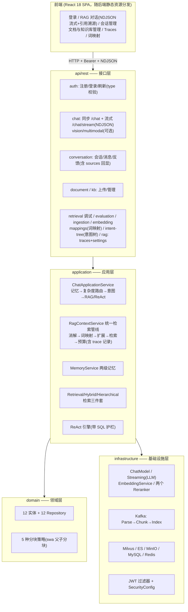

# RAGGG 系统架构总览

> **文档性质**：系统**现状**文档，2026-09-24 与代码全量对账重写（替代 2026-01 的初版设计稿）。
> 所有类名、配置键、端口、指标名均来自当前代码；未实现的能力集中列在 [第十三节 规划清单](#十三规划与未实现清单)，不与现状混写。
> 工程缺陷与修复状态的对账基准见 [known-gaps](../known-gaps.md)；本文与其冲突时以 known-gaps 为准。

---

## 一、系统概览

RAGGG 是基于 Spring Boot 3 + LangChain4j 的 RAG 智能问答系统：Kafka 异步文档流水线、混合检索 + CrossEncoder 精排、层级化分块检索（Sentence Window + Auto-Merging）、ReAct 复杂问题推理引擎、两级会话记忆、NDJSON 流式输出与引用溯源、步骤级链路追踪。

### 1.1 技术栈（与 pom.xml / docker-compose.yml 一致）

| 层级 | 技术 | 说明 |
|------|------|------|
| 后端框架 | Spring Boot 3.2.4 (Java 17) | |
| LLM 框架 | LangChain4j 0.36.0 | 仅阻塞式 ChatModel 使用；流式为自研 JDK HttpClient |
| LLM 提供方 | 任意 OpenAI 兼容端点 | config.yaml `llm.*` 切换（deepseek / zhipu / minimax；类名 DeepSeekStreamingService 为历史遗留） |
| Embedding | BAAI/bge-m3 (1024d) | `embedding.provider`: ollama（本地批量 /api/embed）/ siliconflow（API） |
| 重排 | BAAI/bge-reranker-v2-m3 | SiliconFlow CrossEncoder API 为主，本地 Bi-Encoder 回退 |
| 向量库 | Milvus 2.6.6 | HNSW（M=16, efConstruction=200, **IP**），standalone + etcd |
| 全文检索 | Elasticsearch 8.15.0 | BM25，multi_match + kb_id term 过滤 |
| 消息队列 | Kafka 3.7.0（KRaft，无 ZooKeeper） | 三 topic 流水线 |
| 对象存储 | MinIO | 原始文件 / parsed.txt / chunks.json 三阶段产物 |
| 关系库 | MySQL 8.0（库 rag_system） | JPA，ddl-auto 自动建表 |
| 缓存 | Redis 7 | 记忆窗口 + 摘要缓存 |
| 文档解析 | Apache Tika 2.9.2 | 可选阿里云 OCR/表格增强（extraction.enabled） |
| 安全 | Spring Security + jjwt 0.12.5 | JWT Bearer，/api/** 强制认证 |
| 可观测 | Micrometer + Prometheus + Grafana | 20 面板预置；OpenTelemetry 可选（otel.enabled） |

---

## 二、分层架构



**四层职责**：`api/rest` 只做参数校验与权限；`application` 编排用例（全部业务流程在这层）；`domain` 实体与分块算法（无框架依赖）；`infrastructure` 外部系统适配。

---

## 三、对话请求链路（真实调用链）

### 3.1 流式主链路 `POST /api/v1/chat/stream`（前端现役）

```
ChatController.streamChat()
  ├─ hasKbAccess(kbId) 校验（403 拒绝）
  └─ DeepSeekStreamingService.streamChat() ──异步──▶ doStream()
       1. 发 {"type":"meta","conversationId"}（NDJSON 行）
       2. MemoryService.buildContextPrompt()（仅 conversationId+userId 均非空）
       3. kbId 非空 → RagContextService.build()：
            指代消解 → 词映射归一化 → 查询扩展 → hybridSearch(topK=5, rerank)
            → 上下文 token 预算截断（retrieval.context-max-tokens=4000）
            → 全程记录 RagTraceRun + 5 个步骤节点（失败静默）
       4. Prompt = 参考文档 + 对话历史 + 用户问题
       5. JDK HttpClient 直连 {llm.base-url}/chat/completions（stream=true）
          逐行解析 data: 行 → 发 {"type":"token","delta"}
       6. 结束：assistant 消息（含 sources JSON）写回记忆
          → 发 {"type":"finish","conversationId","fullLength","sources":[...]}
```

**协议**：请求体 `ChatRequest{message, conversationId, userId, kbIds, stream}`；响应是 `text/plain` 的换行分隔 JSON 行（NDJSON），三种事件 meta/token/finish。前端 `chatStore.sendMessage` 用 fetch reader 按行解析，sources 挂到消息渲染引用面板。

### 3.2 同步链路 `POST /api/v1/chat`（评测脚本与调试用）

`ChatApplicationService.chat()`：记忆构建 → `ComplexityRouter`（react.enabled 且 router.enabled 时判 SIMPLE/COMPLEX）→
- **SIMPLE**：`IntentClassifier`（5 类：KNOWLEDGE_QA / CHIT_CHAT / PRECISE_SEARCH / SUMMARY / UNKNOWN；需检索类才走 RAG）→ `RagContextService.build()` → Prompt 生成
- **COMPLEX**：`ReActEngine.execute()`（详见 [03-react-engine](./03-react-engine.md)）——正常完成聚合检索命中为 sources；**降级时回退真实 RAG 链路重新作答**
- 意图为闲聊/检索为空时走意图兜底 Prompt

返回 `ChatResponse{message, sources, intent, conversationId}`。

### 3.3 废弃链路

`GET /api/v1/rag/v3/chat`（SseEmitter，已 @Deprecated，前端不使用）；`POST /api/v1/rag/v3/stop` 仍是返回 200 的 stub（无取消通道，见规划清单）。

---

## 四、文档处理流水线（Kafka 全链路异步）

```mermaid
flowchart LR
    U["上传 API"] -->|"@TransactionalEventListener(AFTER_COMMIT)"| P1
    P1["document-upload"] --> Parse["ParseService\n(rag-system-parse)"]
    Parse -->|"Tika→parsed.txt"| P2["document-parsed"]
    P2 --> Chunk["ChunkService\n(rag-system-chunk)"]
    Chunk -->|"策略分块→chunks.json"| P3["document-chunked"]
    P3 --> Index["IndexService\n(rag-system-index)"]
    Index -->|"批量 embed→MySQL+ES+Milvus"| Done["COMPLETED"]
```



| 阶段 | 关键点 |
|---|---|
| 上传 | MinIO 存原始文件 → MySQL 置 PENDING → 事务提交后才发 Kafka（防消费者读未提交数据） |
| 解析 | Tika 提取（可选 OCR/表格增强）→ parsed.txt → PARSED |
| 分块 | 5 种策略（fixed/structural/semantic/intelligent/swa），**透传上传时的分块参数**；chunks.json → CHUNKED |
| 索引 | 流式解析 chunks.json，按 embedding.batch-size（默认 32）攒批：一次 embedBatch + MySQL saveAll + ES Bulk + Milvus insertBatch（**含 metadata JSON 字段**）→ COMPLETED/FAILED |

**状态机**：`PENDING → PARSING → PARSED → CHUNKING → CHUNKED → INDEXING → COMPLETED / FAILED`。

**可靠性语义**（2026-09-24 修复后）：
- 三个 `@KafkaListener` 方法直接标注 `@Transactional`（监听器经 Spring 代理调用，事务真实生效）
- 无 chunks / chunks.json 损坏 → 置 FAILED 终态（不再卡死在 INDEXING）
- 容器级 `DefaultErrorHandler`（1s × 2 重试）覆盖反序列化/客户端异常；业务失败仍是"置 FAILED 即终态"（有意设计，无 DLT）
- Producer 发送失败计数 `kafka_produce_fail_total{topic}`（无 outbox 补偿，可告警）

**消费参数**：并发 3、max-poll-records 1、max-poll-interval 30min（长解析兜足）、AckMode BATCH。

---

## 五、检索体系

### 5.1 混合检索（hybrid，默认策略）

`HybridRetrievalService.hybridSearch()`：
1. **双路并行**（retrievalThreadPoolExecutor）：Milvus 向量（embed → search，filter `kb_id`，ef=128）‖ ES BM25（multi_match on content + term kb_id），各取 `retrieval.candidate-pool-size`（默认 20）候选
2. **RRF 融合**：`score = Σ 1/(60+rank+1)`（RRF_K=60 硬编码），双路命中累加，**返回全部融合候选**（截断交给上层）
3. **精排**：`SiliconFlowReranker` 调 /rerank API——**top_n 一律传全部候选**（避免 RRF 分与 relevance 分混排），排序后截断 topK；API 失败静默回退原序并计数 `rerank_fallback_total{reason}`（api_error/http_status_N/empty_result/unexpected）
4. 本地回退 `CrossEncoderReranker`（Bi-Encoder 近似，N+1 embedding，仅 provider 切本地时）

### 5.2 层级检索（hierarchical / SWA，已修复生效）

`HierarchicalRetrievalService.retrieve()`：
1. Sentence 召回：hybridSearch(topK×3)，**候选携带 metadata**（Milvus 新增 metadata VarChar 字段存 JSON，ES 动态字段带回；`RetrievalResult` record 含 metadata 字段）
2. Auto-Merging：按 parentChunkId 分组，`hitRatio = 命中叶数/siblingCount ≥ merging-ratio(0.5)` 且命中 ≥2 时合并回父块（内容=叶子拼接，分数=hitRatio×均分+均分×0.5）
3. Sentence Window：保留的叶子用 windowContent 替换内容（原内容存 metadata.originalContent）
4. 回归测试锁定：`HierarchicalRetrievalServiceTest` 四场景 + `MilvusVectorStoreMetadataTest` 序列化往返

> ⚠️ 升级注意：存量 Milvus 集合缺 metadata 字段时启动会 drop 重建（醒目 WARN），需重灌语料。

### 5.3 查询侧（RagContextService 统一管线）

三链路（同步/流式/v3）共用：**指代消解**（有记忆才做，省一次 LLM）→ **词映射归一化**（`QueryTermService`，t_query_term_mapping 规则，60s 缓存，"向量库"→"向量数据库"）→ **查询扩展**（失败回退）→ 检索 → **上下文 token 预算**（`retrieval.context-max-tokens:4000`，与记忆同口径估算，超预算按相关性截断）。

---

## 六、两级会话记忆

`MemoryService`（606 行，经 500 次随机化 soak 打磨）：

- **写路径**：会话级 synchronized 写锁 → 先 MySQL 拿自增 id（水位线）→ Redis List rightPush（key `conversation:messages:{id}`，TTL 7 天）；assistant 消息携带 sources JSON 落 `t_message.sources`
- **读路径**：摘要与消息并行加载；窗口失效时按水位线对账、从 MySQL 补齐（read-through 重建）
- **摘要**：条数 ≥8（辅）或 token ≥2500（主）触发；滚动合并旧摘要；水位线存 `conversation_summary`；按值 LREM 删除已摘要条目（防 leftPush 索引错位）
- **预算组装**：摘要 + 最近消息 ≤ context-max-tokens=3000
- **历史接口**：Redis 快路径按消息 id 批量补齐 sources，MySQL 回源直读——两条路径都回显引用

---

## 七、安全模型（2026-09-24 收紧后）

| 层面 | 现状 |
|---|---|
| 认证 | `/api/**` 默认 `authenticated()`；放行仅 `/api/v1/auth/**`、`/actuator/**`（Prometheus 无 JWT，生产建议内网）、静态 SPA |
| 授权 | `/api/v1/admin/**` 要求 ROLE_ADMIN；`/chat` 与 `/chat/stream` 均有 `hasKbAccess()`（admin 放行 / 校验 kb.createdBy） |
| Token | HS256 JWT：access 24h（claims userId/username/role）、refresh 7 天（type=refresh）；**refresh 端点校验 type claim** |
| 过滤器 | `JwtAuthenticationFilter`：无/坏 Bearer 头不设认证 → 受保护端点由入口点返 401（JSON） |
| ReAct SQL | 只读护栏：SELECT-only、拒绝多语句/注释/INTO OUTFILE、表白名单（`react.actions.database.allowed-tables`）、maxRows=100、10s 超时 |

**已知边界**（详见 known-gaps #security）：无 token 撤销/黑名单；默认 secret 硬编码源码；`/actuator` 公开；RBAC 仍是 t_user.role 单字段（无 Role/Permission 实体）。

---

## 八、可观测性

- **指标**（Micrometer → `/actuator/prometheus`）：
  - 流水线：`doc.pipeline{stage}`、`doc.pipeline.chunk_ops{op=embed_batch|persist}`、`doc.pipeline.count`、`doc.pipeline.chunk_count`
  - 检索：rerank 延迟、`rerank_fallback_total{reason}`（静默回退告警锚点）
  - Kafka：`kafka_produce_fail_total{topic}`
  - 记忆：`memory.summary.total`、`memory.rebuild.total`、`memory.context.tokens`
- **链路追踪（已落地）**：`RagContextService.build` 每次执行记录 `RagTraceRun` + 步骤节点（condense/term_mapping/expand/hybrid_retrieval/context_assembly，含耗时与 extraData，落库失败静默）；`GET /api/v1/rag/traces/runs`（分页过滤）、`/traces/runs/{traceId}`（瀑布明细）——前端 Traces 管理页直接消费
- **面板**：Grafana provisioning 预置 20 面板（上传链路 P50-P99/各阶段延迟/逐 chunk 操作/吞吐/in-flight）；**覆盖仅文档流水线**，检索/记忆面板待补
- **OpenTelemetry**（可选，otel.enabled）：OTLP 导出 localhost:4317

---

## 九、数据存储总览

| 存储 | 内容 | 关键细节 |
|---|---|---|
| MySQL（12 活表） | 用户/KB/文档/分块/会话/消息（含 sources 列）/摘要/反馈/trace 两表/意图树/词映射 | ddl-auto 建表；11 张死表见 known-gaps#database |
| Milvus | chunk 向量：doc_id(PK)/chunk_id/document_id/content/embedding/kb_id/**metadata(JSON)** | HNSW IP；启动维度不匹配或缺 metadata 字段会重建（丢数据） |
| ES | chunk 全文：id/content/document_id/kb_id/created_at + metadata 动态字段 | BM25 |
| Redis | `conversation:messages:{id}`（List）/ `conversation:summary:{id}` | TTL 7 天，MySQL 回源重建 |
| MinIO | 原始文件 / {kb}/{doc}/parsed.txt / chunks.json | Kafka 消息只传引用 |

---

## 十、配置体系

- **config.yaml**（gitignore，模板 config.yaml.example）：`server.ip` 一处汇聚中间件地址；llm / embedding（provider 二选一）/ reranker / milvus / elasticsearch / kafka / mysql / redis / minio / memory / extraction
- **application.yml 运行时开关**（环境变量可覆盖）：`retrieval.strategy`（hybrid/hierarchical）、`retrieval.rerank.provider`、`retrieval.swa.merging-ratio/window-size`、`retrieval.candidate-pool-size`、`retrieval.context-max-tokens`、`memory.*`、`react.*`、`llm.multimodal.enabled`、`otel.enabled`
- 端口约定：有 config.yaml → app.port（8080）；无 → 回落 8081

---

## 十一、部署拓扑

单机形态：一个后端实例 + compose 12 服务（MySQL 23306 / Redis 26379 / ES 29201 / Milvus 29530+etcd / MinIO 29005 / Kafka 29292 / Ollama 11434 / Prometheus 29090 / Grafana 23000 / Pushgateway 19991 / Attu 20000）。

**水平扩容限制**（详见 [部署文档](../guides/02-deployment.md)）：Kafka 消费者组天然多实例；会话写锁与 ReAct 缓存为 JVM 级；Milvus 维度/字段不一致会互相触发重建；流式连接需 sticky session。

---

## 十二、前端架构（React 18 + Vite + zustand）

- 路由：`/chat`（对话）、`/login`、`/admin/*`（dashboard / knowledge 三级页 / traces 瀑布 / settings / sample-questions）
- 流式：fetch + reader 解析 NDJSON；引用来源面板（MessageItem 可折叠）
- 认证：axios 拦截器注入 Bearer；401 清 auth 跳登录
- 管理端调用词映射 `/mappings`、意图树 `/intent-tree`（API 均已落地）

---

## 十三、规划与未实现清单（2026-09-24 对账）

| 项 | 状态 | 说明 |
|---|---|---|
| 分布式限流接入 | 🚫 | DistributedRateLimiter 已实现但全工程零调用；SSE 排队推送依赖它，一并未落地 |
| SSE Hub（连接管理/队列/Pub-Sub 广播） | 🚫 | 流式为每请求独立 Emitter |
| 流式停止 /v3/stop | 🚫 stub | 返回 200 无取消逻辑；客户端断开仅靠下一次 send 抛异常感知 |
| RBAC 三实体（Role/Permission 表与方法级注解） | 🚫 | 现为 t_user.role 单字段 + SecurityConfig 路径级控制 |
| 自动评测触发（定时/on_kb_update/告警） | 🚫 | 仅手动 API + stress-test 脚本 |
| 意图树路由消费 | 🚫 | CRUD API 已落地，按意图路由 topK/collection/提示词未接检索管线 |
| 检索结果缓存 / 语义去重 | 🚫 | 仅 ReAct ActionCache 有嵌入相似度复用 |
| ReAct 监控指标 react.* | 🚫 | 仅日志 |
| 检索/记忆 Grafana 面板 | 🚫 | 现面板仅文档流水线 |
| Token 撤销/黑名单、actuator 收紧 | 🚫 | 见 known-gaps#security |

---

## 十四、版本历史

| 版本 | 日期 | 修改内容 |
|------|------|----------|
| 1.0.0 | 2026-01 | 初版设计文档（设计+规划混合） |
| 1.1.0 | 2026-09-24 | 全面对账：各节补实现状态标注 |
| 2.0.0 | 2026-09-24 | **重写为现状文档**：真实调用链/流水线/安全/可观测性/部署，规划与现状分离（第十三节） |
