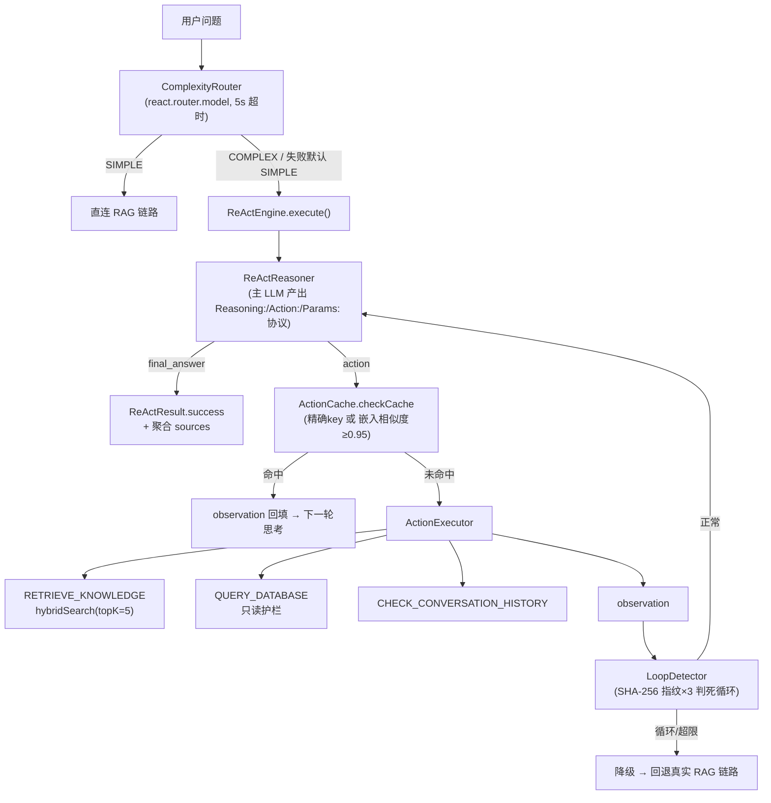

# ReAct 推理引擎：设计与实现

> **文档性质**：设计与实现合一的现状文档，2026-09-24 重写。引擎位于 `application/chat/react/`，由 `react.enabled` 开关控制（application.yml 默认 false，当前 config.yaml 为 true）。当日修复了四项遗留（SQL 护栏/降级回退/溯源/状态隔离），明细见 [known-gaps#react](../实现差距清单.md#react)。

---

## 一、背景与目标

简单 RAG 链路（一次检索 + 一次生成）处理不了**多步骤推理**：问题需要连续的"检索→观察→再检索"，或需要跨知识源（知识库/数据库/会话历史）取数。ReAct（Reasoning + Acting）用"思考→行动→观察"循环补这块能力。

目标：
- **复杂度路由**：简单问题直连 RAG（不付 agent 成本），复杂问题才进循环
- **多知识源动作**：知识检索 / 数据库查询 / 会话历史
- **缓存复用**：相似动作不重复执行
- **死循环防护**：检测并打断重复推理
- **优雅降级**：任何失败回退到真实 RAG 链路（而不是返回系统内部执行摘要）

---

## 二、整体架构



**组件清单**（均在 `application/chat/react/` 包内）：

| 组件 | 职责 |
|---|---|
| `ComplexityRouter` | LLM 判定 SIMPLE/COMPLEX（JSON 输出；解析失败/超时默认 SIMPLE——路由挂了不能拦住正常问答） |
| `ReActEngine` | 主循环编排（≤ max-iterations=5 轮） |
| `ReActReasoner` | 用主 ChatModel 生成自由文本，按行首 `Reasoning:/Action:/Params:` 解析 |
| `ActionExecutor` | 执行三种动作（详见第四节） |
| `ActionCache` | 动作结果缓存（详见第五节） |
| `LoopDetector` | 死循环检测（详见第六节） |
| `LocalLlmClient` | 轻量 LLM 客户端（事实提炼用；provider=local 时启用本地端点，当前配置走远程） |
| `model/` | Thought / Action / ActionResult(含 sources) / ReActResult(含 ActionRecord) / TaskComplexity / LoopDetectionResult / ActionType |

---

## 三、复杂度路由

`ComplexityRouter.classify(query, context)` → `TaskComplexity.SIMPLE / COMPLEX`：

- 模型与超时：`react.router.model`（当前 deepseek-chat）、`react.router.timeout-ms`（5000；AppConfig 内置默认是早期 Qwen2-1.5B 本地方案的 100ms，实际配置以 config.yaml 为准）
- 调用链仅当 `react.enabled && react.router.enabled` 时激活
- **失败语义**：WebClient 超时/解析失败/异常 → 一律 SIMPLE

> 设计取舍：本地小模型（Qwen2-1.5B-INT4）方案未采用——部署复杂度收益不抵远程 API 的便利；`LocalLlmClient` 保留本地端点能力。

---

## 四、动作空间与 SQL 护栏

`ActionType`：`RETRIEVE_KNOWLEDGE` / `QUERY_DATABASE` / `CHECK_CONVERSATION_HISTORY` / `FINAL_ANSWER`。

### 4.1 RETRIEVE_KNOWLEDGE

`ActionExecutor` → `HybridRetrievalService.hybridSearch(query, kbId, topK)`（topK=`react.actions.knowledge.top-k`=5，可被 LLM params.topK 覆盖）。**2026-09-24 起 ActionResult 携带原始检索命中（sources）**，ChatApplicationService 按 chunkId 去重聚合（前 5 条）随响应返回——ReAct 分支可溯源。

### 4.2 QUERY_DATABASE（带只读护栏）

SQL 来源：LLM 的 `params.sql`，或从用户问题文本截取 `select...from...`。执行前过 `validateSqlGuardrails()`（`react.actions.database.*` 配置）：

| 护栏 | 行为 |
|---|---|
| `readOnly=true`（默认） | 仅放行单条 SELECT/WITH 开头语句；拒绝分号多语句、`--`/`/*` 注释、`INTO OUTFILE/DUMPFILE` 导出 |
| `allowed-tables`（默认空=不限） | FROM/JOIN 提取表名比对白名单（反引号剥离），不在名单直接拒绝 |
| `maxRows=100` + 10s 查询超时 | PreparedStatement 层 `setMaxRows/setQueryTimeout` 硬限制 |

拒绝时 warn 日志留痕（含原始 SQL，供审计），返回失败 observation 给 Reasoner。

### 4.3 CHECK_CONVERSATION_HISTORY

读 `MemoryService.getContext(userId, conversationId)`——需要 LLM 在 params 里给出两个 ID（Reasoner prompt 未提供，实际命中率低，属已知局限）。

---

## 五、ActionCache（TTL + 容量上限）

- **命中路径**：精确 cacheKey（type+params 拼接）命中；或 `EmbeddingService` 对 cacheKey 与缓存条目算余弦 **≥ `react.cache.similarity-threshold.direct-hit`(0.95)** 直接复用
- **写入**：动作执行后 `getOrCompute` 写入（带 embedding 惰性计算）
- **TTL 与容量**（2026-09-24 新增）：`react.cache.ttl-ms`（默认 1h，0=不过期）过期条目读写时清理；`react.cache.max-entries`（默认 500）超限按写入时间淘汰最旧——此前无上限，长期运行内存只涨不跌
- 边界：0.85~0.95 复核区（`needsReview`）与 `LocalLlmClient.isDuplicate` 为**死代码**，引擎从不调用（保留待接线）

---

## 六、LoopDetector（执行级状态隔离）

- **指纹**：observation 经 `extractCoreFact`（LocalLlmClient 可用则 LLM 提事实数组，否则正则去噪：剔除时间戳/UUID/长数字/random|uuid|id）→ SHA-256 取前 16 hex
- **判定**：尾部连续相同指纹 ≥ `react.loop-detection.fingerprint-match-count`(3) 判死循环；轮数达 `max-iterations`(5) 也触发降级
- **状态隔离**（2026-09-24 修复）：指纹历史从 LoopDetector 单例实例字段改为 **每次 execute() 创建独立 `ExecutionState`**——此前并发 ReAct 请求互相污染/重置指纹历史，会误判死循环

---

## 七、降级策略（回退真实 RAG）

触发：死循环 / 达最大轮次 / Reasoner 无法产出 Action / 引擎未启用。

**2026-09-24 修复后的行为**：`ChatApplicationService.executeReAct()` 检测到 `ReActResult.degraded` 时，**走 `performSimpleFlow`（意图分类 → 统一检索管线 → 生成）重新作答**，降级原因只进日志。

> 修复前：降级把"ReAct 执行摘要 + 降级原因"拼成文本直接当用户答案返回——用户会看到一段系统内部口吻的调试信息。

---

## 八、配置参考

```yaml
react:
  enabled: true                  # 引擎总开关
  router:
    enabled: true
    model: deepseek-chat
    timeout-ms: 5000
  lightweight-llm:                # 事实提炼用（provider=local 时走本地端点）
    model: glm-5.3-flash
  actions:
    knowledge: { enabled: true, top-k: 5 }
    database:
      enabled: true
      read-only: true            # SELECT-only 护栏
      allowed-tables: []         # 表白名单（空=不限；生产建议白名单）
      max-rows: 100
    conversation: { enabled: true, window-size: 10 }
  cache:
    enabled: true
    ttl-ms: 3600000              # 2026-09-24 新增
    max-entries: 500             # 2026-09-24 新增
    similarity-threshold: { direct-hit: 0.95, review: 0.85 }
  loop-detection:
    enabled: true
    max-iterations: 5
    fingerprint-match-count: 3
```

---

## 九、监控与已知遗留

- **监控**：`react.*` Micrometer 指标未实现（规划项），当前只有结构化日志（迭代轮次/动作类型/命中/降级原因均可 grep）
- **遗留**：0.85 复核区死代码；CHECK_CONVERSATION_HISTORY 实际命中率低；Reasoner 的 `extractAnswer` 在 final_answer 时直接取 Reasoning 行当答案（答案质量依赖模型自觉）

---

## 十、测试与验证

引擎整体无专属单测（协议解析层由 StreamingChatModelServiceTest 间接覆盖）；护栏与状态隔离的正确性目前由代码评审 + known-gaps 记录保障。回归测试建议项：SQL 护栏的拒绝矩阵（多语句/注释/写语句/白名单外表）与降级回退路径。

---

## 附：术语表

| 术语 | 说明 |
|---|---|
| ReAct | Reasoning + Acting，思考-行动-观察循环的 agent 范式 |
| 指纹 | observation 去噪核心事实的 SHA-256 前 16 位，用于死循环检测 |
| 降级 | 从 ReAct 循环回退到简单 RAG 链路 |
| 直接命中 | 缓存相似度 ≥0.95 的免执行复用 |
