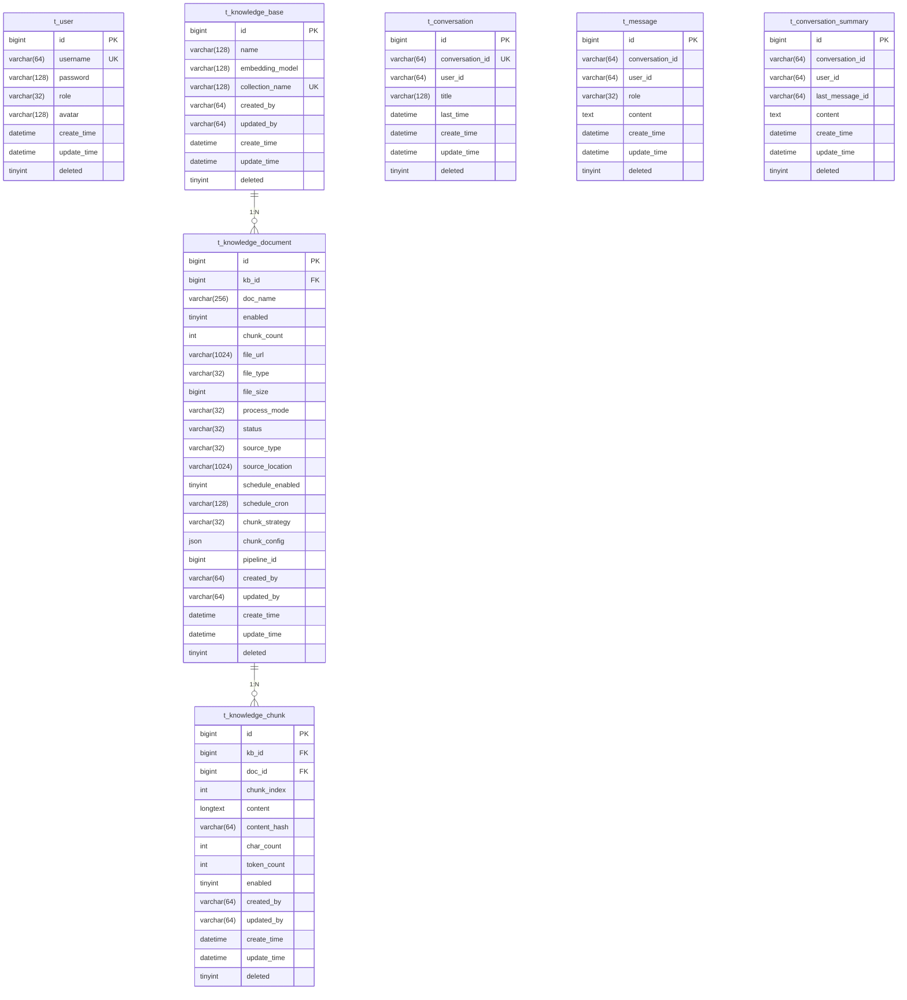

# RAG 数据库设计文档

## 概述

- **数据库名称**: `rag_system` / `ragent`
- **字符集**: `utf8mb4`
- **存储引擎**: InnoDB
- **表数量**: 22 张表

---

## ER 关系图



---

## 表结构详情

### 1. 用户表 (t_user)

| 字段 | 类型 | 约束 | 说明 |
|------|------|------|------|
| id | BIGINT | PK, AUTO_INCREMENT | 用户ID |
| username | VARCHAR(64) | NOT NULL, UNIQUE | 用户名 |
| password | VARCHAR(128) | NOT NULL | 密码 (BCrypt加密) |
| role | VARCHAR(32) | NOT NULL, DEFAULT 'USER' | 角色: ADMIN / USER |
| avatar | VARCHAR(128) | | 头像URL |
| create_time | DATETIME | | 创建时间 |
| update_time | DATETIME | | 更新时间 |
| deleted | TINYINT | NOT NULL, DEFAULT 0 | 软删除标记 |

**索引**:
- `idx_username` (username)
- `idx_role` (role)

---

### 2. 知识库表 (t_knowledge_base)

| 字段 | 类型 | 约束 | 说明 |
|------|------|------|------|
| id | BIGINT | PK, AUTO_INCREMENT | 知识库ID |
| name | VARCHAR(128) | NOT NULL | 知识库名称 |
| embedding_model | VARCHAR(128) | NOT NULL |  embedding 模型 |
| collection_name | VARCHAR(128) | NOT NULL, UNIQUE | Milvus 集合名 |
| created_by | VARCHAR(64) | NOT NULL | 创建人 |
| updated_by | VARCHAR(64) | | 更新人 |
| create_time | DATETIME | NOT NULL | 创建时间 |
| update_time | DATETIME | NOT NULL | 更新时间 |
| deleted | TINYINT(1) | NOT NULL, DEFAULT 0 | 软删除标记 |

**索引**:
- `idx_name` (name)
- `idx_created_by` (created_by)

---

### 3. 知识库文档表 (t_knowledge_document)

| 字段 | 类型 | 约束 | 说明 |
|------|------|------|------|
| id | BIGINT | PK, AUTO_INCREMENT | 文档ID |
| kb_id | BIGINT | NOT NULL, FK | 所属知识库ID |
| doc_name | VARCHAR(256) | NOT NULL | 文档名称 |
| enabled | TINYINT(1) | NOT NULL, DEFAULT 1 | 是否启用 |
| chunk_count | INT | DEFAULT 0 | 分块数量 |
| file_url | VARCHAR(1024) | NOT NULL | 文件存储URL |
| file_type | VARCHAR(32) | NOT NULL | 文件类型 |
| file_size | BIGINT | | 文件大小 |
| process_mode | VARCHAR(32) | DEFAULT 'chunk' | 处理模式 |
| status | VARCHAR(32) | NOT NULL, DEFAULT 'PENDING' | 状态 |
| source_type | VARCHAR(32) | | 来源类型 |
| source_location | VARCHAR(1024) | | 来源位置 |
| schedule_enabled | TINYINT(1) | | 定时调度是否启用 |
| schedule_cron | VARCHAR(128) | | 定时调度 Cron 表达式 |
| chunk_strategy | VARCHAR(32) | | 分块策略 |
| chunk_config | JSON | | 分块配置 |
| pipeline_id | BIGINT | | 流水线ID |
| created_by | VARCHAR(64) | NOT NULL | 创建人 |
| updated_by | VARCHAR(64) | | 更新人 |
| create_time | DATETIME | NOT NULL | 创建时间 |
| update_time | DATETIME | NOT NULL | 更新时间 |
| deleted | TINYINT(1) | NOT NULL, DEFAULT 0 | 软删除标记 |

**文档状态 (status)**:
- `PENDING` - 待处理
- `PROCESSING` - 处理中
- `PARSING` - 解析中
- `PARSED` - 已解析
- `CHUNKING` - 分块中
- `CHUNKED` - 已分块
- `INDEXING` - 索引中
- `COMPLETED` - 已完成
- `FAILED` - 失败

**索引**:
- `idx_kb_id` (kb_id)
- `idx_status` (status)
- `idx_created_by` (created_by)
- `idx_source_type` (source_type)

---

### 4. 知识库分块表 (t_knowledge_chunk)

| 字段 | 类型 | 约束 | 说明 |
|------|------|------|------|
| id | BIGINT | PK, AUTO_INCREMENT | 分块ID |
| kb_id | BIGINT | NOT NULL, FK | 所属知识库ID |
| doc_id | BIGINT | NOT NULL, FK | 所属文档ID |
| chunk_index | INT | NOT NULL | 分块索引 |
| content | LONGTEXT | NOT NULL | 分块内容 |
| content_hash | VARCHAR(64) | | 内容哈希 |
| char_count | INT | | 字符数 |
| token_count | INT | | Token数 |
| enabled | TINYINT(1) | NOT NULL, DEFAULT 1 | 是否启用 |
| created_by | VARCHAR(64) | NOT NULL | 创建人 |
| updated_by | VARCHAR(64) | | 更新人 |
| create_time | DATETIME | NOT NULL | 创建时间 |
| update_time | DATETIME | NOT NULL | 更新时间 |
| deleted | TINYINT(1) | NOT NULL, DEFAULT 0 | 软删除标记 |

**索引**:
- `idx_doc_id` (doc_id)
- `idx_kb_id` (kb_id)
- `idx_content_hash` (content_hash)
- `idx_enabled` (enabled)

---

### 5. 对话会话表 (t_conversation)

| 字段 | 类型 | 约束 | 说明 |
|------|------|------|------|
| id | BIGINT | PK, AUTO_INCREMENT | 主键ID |
| conversation_id | VARCHAR(64) | NOT NULL, UNIQUE | 对话会话ID |
| user_id | VARCHAR(64) | NOT NULL | 用户ID |
| title | VARCHAR(128) | NOT NULL | 对话标题 |
| last_time | DATETIME | | 最后活跃时间 |
| create_time | DATETIME | | 创建时间 |
| update_time | DATETIME | | 更新时间 |
| deleted | TINYINT | NOT NULL, DEFAULT 0 | 软删除标记 |

**索引**:
- `idx_conversation_id` (conversation_id) UNIQUE
- `idx_user_id` (user_id)
- `idx_last_time` (last_time)

---

### 6. 对话消息表 (t_message)

| 字段 | 类型 | 约束 | 说明 |
|------|------|------|------|
| id | BIGINT | PK, AUTO_INCREMENT | 消息ID |
| conversation_id | VARCHAR(64) | NOT NULL | 会话ID |
| user_id | VARCHAR(64) | NOT NULL | 用户ID |
| role | VARCHAR(32) | NOT NULL | 角色: user / assistant / system |
| content | TEXT | NOT NULL | 消息内容 |
| create_time | DATETIME | | 创建时间 |
| update_time | DATETIME | | 更新时间 |
| deleted | TINYINT | NOT NULL, DEFAULT 0 | 软删除标记 |

**索引**:
- `idx_msg_conversation_id` (conversation_id)
- `idx_msg_user_id` (user_id)
- `idx_role` (role)

---

### 7. 对话摘要表 (t_conversation_summary)

| 字段 | 类型 | 约束 | 说明 |
|------|------|------|------|
| id | BIGINT | PK, AUTO_INCREMENT | 摘要ID |
| conversation_id | VARCHAR(64) | NOT NULL | 会话ID |
| user_id | VARCHAR(64) | NOT NULL | 用户ID |
| last_message_id | VARCHAR(64) | NOT NULL | 最后消息ID |
| content | TEXT | NOT NULL | 摘要内容 |
| create_time | DATETIME | | 创建时间 |
| update_time | DATETIME | | 更新时间 |
| deleted | TINYINT | NOT NULL, DEFAULT 0 | 软删除标记 |

**索引**:
- `idx_conv_id` (conversation_id)
- `idx_user_id` (user_id)

---

### 8. 摄入流水线表 (t_ingestion_pipeline)

| 字段 | 类型 | 约束 | 说明 |
|------|------|------|------|
| id | BIGINT | PK, AUTO_INCREMENT | 流水线ID |
| name | VARCHAR(100) | NOT NULL | 流水线名称 |
| description | TEXT | | 描述 |
| created_by | VARCHAR(64) | | 创建人 |
| updated_by | VARCHAR(64) | | 更新人 |
| create_time | DATETIME | NOT NULL | 创建时间 |
| update_time | DATETIME | NOT NULL | 更新时间 |
| deleted | TINYINT(1) | NOT NULL, DEFAULT 0 | 软删除标记 |

**索引**:
- `idx_name` (name)

---

### 9. 流水线节点定义表 (t_ingestion_pipeline_node)

| 字段 | 类型 | 约束 | 说明 |
|------|------|------|------|
| id | BIGINT | PK, AUTO_INCREMENT | 节点ID |
| pipeline_id | BIGINT | NOT NULL, FK | 所属流水线ID |
| node_id | VARCHAR(64) | NOT NULL | 节点唯一标识 |
| node_type | VARCHAR(30) | NOT NULL | 节点类型 |
| next_node_id | VARCHAR(64) | | 下一节点ID |
| settings_json | JSON | | 节点配置 |
| condition_json | JSON | | 条件配置 |
| created_by | VARCHAR(64) | | 创建人 |
| updated_by | VARCHAR(64) | | 更新人 |
| create_time | DATETIME | NOT NULL | 创建时间 |
| update_time | DATETIME | NOT NULL | 更新时间 |
| deleted | TINYINT(1) | NOT NULL, DEFAULT 0 | 软删除标记 |

**索引**:
- `idx_pipeline_id` (pipeline_id)
- `idx_node_type` (node_type)

---

### 10. 摄入任务表 (t_ingestion_task)

| 字段 | 类型 | 约束 | 说明 |
|------|------|------|------|
| id | BIGINT | PK, AUTO_INCREMENT | 任务ID |
| pipeline_id | BIGINT | NOT NULL, FK | 流水线ID |
| source_type | VARCHAR(20) | NOT NULL | 来源类型 |
| source_location | TEXT | | 来源位置 |
| source_file_name | VARCHAR(255) | | 源文件名 |
| status | VARCHAR(20) | NOT NULL, DEFAULT 'PENDING' | 任务状态 |
| chunk_count | INT | DEFAULT 0 | 分块数量 |
| error_message | TEXT | | 错误信息 |
| logs_json | JSON | | 任务日志 |
| metadata_json | JSON | | 元数据 |
| started_at | DATETIME | | 开始时间 |
| completed_at | DATETIME | | 完成时间 |
| created_by | VARCHAR(64) | | 创建人 |
| updated_by | VARCHAR(64) | | 更新人 |
| create_time | DATETIME | NOT NULL | 创建时间 |
| update_time | DATETIME | NOT NULL | 更新时间 |
| deleted | TINYINT(1) | NOT NULL, DEFAULT 0 | 软删除标记 |

**索引**:
- `idx_pipeline_id` (pipeline_id)
- `idx_status` (status)
- `idx_source_type` (source_type)

---

### 11. 任务节点执行记录表 (t_ingestion_task_node)

| 字段 | 类型 | 约束 | 说明 |
|------|------|------|------|
| id | BIGINT | PK, AUTO_INCREMENT | 记录ID |
| task_id | BIGINT | NOT NULL, FK | 任务ID |
| pipeline_id | BIGINT | NOT NULL, FK | 流水线ID |
| node_id | VARCHAR(64) | NOT NULL | 节点ID |
| node_type | VARCHAR(30) | NOT NULL | 节点类型 |
| node_order | INT | NOT NULL, DEFAULT 0 | 节点顺序 |
| status | VARCHAR(20) | NOT NULL | 执行状态 |
| duration_ms | BIGINT | NOT NULL, DEFAULT 0 | 执行耗时(毫秒) |
| message | TEXT | | 消息 |
| error_message | TEXT | | 错误信息 |
| output_json | LONGTEXT | | 输出数据 |
| create_time | DATETIME | NOT NULL | 创建时间 |
| update_time | DATETIME | NOT NULL | 更新时间 |
| deleted | TINYINT(1) | NOT NULL, DEFAULT 0 | 软删除标记 |

**索引**:
- `idx_task_id` (task_id)
- `idx_status` (status)
- `idx_node_type` (node_type)

---

### 12. 消息反馈表 (t_message_feedback)

| 字段 | 类型 | 约束 | 说明 |
|------|------|------|------|
| id | BIGINT | PK, AUTO_INCREMENT | 反馈ID |
| message_id | BIGINT | NOT NULL | 消息ID |
| conversation_id | VARCHAR(64) | NOT NULL | 会话ID |
| user_id | VARCHAR(64) | NOT NULL | 用户ID |
| vote | TINYINT(1) | NOT NULL | 投票: 1 点赞, 0 差评 |
| reason | VARCHAR(255) | | 投票原因 |
| comment | VARCHAR(1024) | | 评论 |
| create_time | DATETIME | NOT NULL | 创建时间 |
| update_time | DATETIME | NOT NULL | 更新时间 |
| deleted | TINYINT(1) | NOT NULL, DEFAULT 0 | 软删除标记 |

**索引**:
- `idx_message_id` (message_id)
- `idx_fb_conversation_id` (conversation_id)
- `idx_fb_user_id` (user_id)

---

### 13. 意图节点表 (t_intent_node)

| 字段 | 类型 | 约束 | 说明 |
|------|------|------|------|
| id | BIGINT | PK, AUTO_INCREMENT | 意图ID |
| kb_id | BIGINT | | 知识库ID |
| intent_code | VARCHAR(64) | NOT NULL | 意图代码 |
| name | VARCHAR(64) | NOT NULL | 意图名称 |
| level | TINYINT | NOT NULL | 层级 |
| parent_code | VARCHAR(64) | | 父级代码 |
| description | VARCHAR(512) | | 描述 |
| examples | TEXT | | 示例 |
| collection_name | VARCHAR(128) | | 集合名称 |
| top_k | INT | | Top-K 参数 |
| mcp_tool_id | VARCHAR(128) | | MCP工具ID |
| kind | TINYINT(1) | NOT NULL, DEFAULT 0 | 类型 |
| prompt_snippet | TEXT | | 提示词片段 |
| prompt_template | TEXT | | 提示词模板 |
| param_prompt_template | TEXT | | 参数化提示词模板 |
| sort_order | INT | NOT NULL, DEFAULT 0 | 排序 |
| enabled | TINYINT(1) | NOT NULL, DEFAULT 1 | 是否启用 |
| create_by | VARCHAR(64) | | 创建人 |
| update_by | VARCHAR(64) | | 更新人 |
| create_time | DATETIME | NOT NULL | 创建时间 |
| update_time | DATETIME | NOT NULL | 更新时间 |
| deleted | TINYINT(1) | NOT NULL, DEFAULT 0 | 软删除标记 |

**索引**:
- `idx_intent_code` (intent_code)
- `idx_kb_id` (kb_id)
- `idx_level` (level)
- `idx_enabled` (enabled)

---

### 14. 示例问题表 (t_sample_question)

| 字段 | 类型 | 约束 | 说明 |
|------|------|------|------|
| id | BIGINT | PK, AUTO_INCREMENT | ID |
| title | VARCHAR(64) | | 标题 |
| description | VARCHAR(255) | | 描述 |
| question | VARCHAR(1024) | NOT NULL | 问题内容 |
| create_time | DATETIME | | 创建时间 |
| update_time | DATETIME | | 更新时间 |
| deleted | TINYINT | NOT NULL, DEFAULT 0 | 软删除标记 |

**索引**:
- `idx_sq_deleted` (deleted)

---

### 15. 查询词映射表 (t_query_term_mapping)

| 字段 | 类型 | 约束 | 说明 |
|------|------|------|------|
| id | BIGINT | PK, AUTO_INCREMENT | ID |
| domain | VARCHAR(64) | | 领域 |
| source_term | VARCHAR(128) | NOT NULL | 源词 |
| target_term | VARCHAR(128) | NOT NULL | 目标词 |
| match_type | TINYINT | NOT NULL, DEFAULT 1 | 匹配类型 |
| priority | INT | NOT NULL, DEFAULT 100 | 优先级 |
| enabled | TINYINT | NOT NULL, DEFAULT 1 | 是否启用 |
| remark | VARCHAR(255) | | 备注 |
| create_by | VARCHAR(64) | | 创建人 |
| update_by | VARCHAR(64) | | 更新人 |
| create_time | DATETIME | NOT NULL | 创建时间 |
| update_time | DATETIME | NOT NULL | 更新时间 |
| deleted | TINYINT(1) | NOT NULL, DEFAULT 0 | 软删除标记 |

**索引**:
- `idx_domain` (domain)
- `idx_source_term` (source_term)
- `idx_qtm_enabled` (enabled)

---

### 16. RAG追踪运行表 (t_rag_trace_run)

| 字段 | 类型 | 约束 | 说明 |
|------|------|------|------|
| id | BIGINT | PK, AUTO_INCREMENT | 追踪ID |
| trace_id | VARCHAR(64) | NOT NULL, UNIQUE | 追踪唯一标识 |
| trace_name | VARCHAR(128) | | 追踪名称 |
| entry_method | VARCHAR(256) | | 入口方法 |
| conversation_id | VARCHAR(64) | | 会话ID |
| task_id | VARCHAR(64) | | 任务ID |
| user_id | VARCHAR(64) | | 用户ID |
| status | VARCHAR(16) | NOT NULL, DEFAULT 'RUNNING' | 状态 |
| error_message | VARCHAR(1000) | | 错误信息 |
| start_time | DATETIME(3) | | 开始时间 |
| end_time | DATETIME(3) | | 结束时间 |
| duration_ms | BIGINT | | 耗时(毫秒) |
| extra_data | TEXT | | 额外数据 |
| create_time | DATETIME | | 创建时间 |
| update_time | DATETIME | | 更新时间 |
| deleted | TINYINT | NOT NULL, DEFAULT 0 | 软删除标记 |

**索引**:
- `idx_trace_conversation_id` (conversation_id)
- `idx_trace_user_id` (user_id)
- `idx_trace_status` (status)
- `idx_trace_task_id` (task_id)

---

### 17. RAG追踪节点表 (t_rag_trace_node)

| 字段 | 类型 | 约束 | 说明 |
|------|------|------|------|
| id | BIGINT | PK, AUTO_INCREMENT | 节点ID |
| trace_id | VARCHAR(64) | NOT NULL, FK | 追踪ID |
| node_id | VARCHAR(64) | NOT NULL | 节点唯一标识 |
| parent_node_id | VARCHAR(64) | | 父节点ID |
| depth | INT | DEFAULT 0 | 深度 |
| node_type | VARCHAR(64) | | 节点类型 |
| node_name | VARCHAR(128) | | 节点名称 |
| class_name | VARCHAR(256) | | 类名 |
| method_name | VARCHAR(128) | | 方法名 |
| status | VARCHAR(16) | NOT NULL, DEFAULT 'RUNNING' | 状态 |
| error_message | VARCHAR(1000) | | 错误信息 |
| start_time | DATETIME(3) | | 开始时间 |
| end_time | DATETIME(3) | | 结束时间 |
| duration_ms | BIGINT | | 耗时(毫秒) |
| extra_data | TEXT | | 额外数据 |
| create_time | DATETIME | | 创建时间 |
| update_time | DATETIME | | 更新时间 |
| deleted | TINYINT | NOT NULL, DEFAULT 0 | 软删除标记 |

**索引**:
- `idx_tn_trace_id` (trace_id)
- `idx_tn_status` (status)
- `idx_parent_node_id` (parent_node_id)

---

### 18. 文档处理异步消息表 (doc_outbox)

| 字段 | 类型 | 约束 | 说明 |
|------|------|------|------|
| id | BIGINT | PK, AUTO_INCREMENT | ID |
| task_id | VARCHAR(64) | NOT NULL | 任务ID |
| step | VARCHAR(32) | NOT NULL | 步骤 |
| payload | JSON | | 消息内容 |
| status | VARCHAR(16) | NOT NULL, DEFAULT 'PENDING' | 状态 |
| retry_count | INT | DEFAULT 0 | 重试次数 |
| error_message | VARCHAR(512) | | 错误信息 |
| created_at | DATETIME | DEFAULT CURRENT_TIMESTAMP | 创建时间 |
| updated_at | DATETIME | | 更新时间 |

**索引**:
- `idx_outbox_task_id` (task_id)
- `idx_outbox_status` (status)

---

### 19. 文档处理日志表 (doc_processing_log)

| 字段 | 类型 | 约束 | 说明 |
|------|------|------|------|
| id | BIGINT | PK, AUTO_INCREMENT | ID |
| task_id | VARCHAR(64) | NOT NULL | 任务ID |
| step | VARCHAR(32) | NOT NULL | 步骤 |
| processed_at | DATETIME | DEFAULT CURRENT_TIMESTAMP | 处理时间 |

**索引**:
- `idx_log_task_id` (task_id)

---

### 20. 文档分块处理日志表 (t_knowledge_document_chunk_log)

| 字段 | 类型 | 约束 | 说明 |
|------|------|------|------|
| id | BIGINT | PK, AUTO_INCREMENT | ID |
| doc_id | BIGINT | NOT NULL, FK | 文档ID |
| status | VARCHAR(20) | NOT NULL | 状态 |
| process_mode | VARCHAR(20) | | 处理模式 |
| chunk_strategy | VARCHAR(50) | | 分块策略 |
| pipeline_id | BIGINT | | 流水线ID |
| extract_duration | BIGINT | | 提取耗时 |
| chunk_duration | BIGINT | | 分块耗时 |
| embedding_duration | BIGINT | | 向量化耗时 |
| total_duration | BIGINT | | 总耗时 |
| chunk_count | INT | | 分块数量 |
| error_message | TEXT | | 错误信息 |
| start_time | DATETIME | | 开始时间 |
| end_time | DATETIME | | 结束时间 |
| create_time | DATETIME | DEFAULT CURRENT_TIMESTAMP | 创建时间 |
| update_time | DATETIME | | 更新时间 |

**索引**:
- `idx_log_doc_id` (doc_id)
- `idx_log_status` (status)

---

### 21. 文档定时调度配置表 (t_knowledge_document_schedule)

| 字段 | 类型 | 约束 | 说明 |
|------|------|------|------|
| id | BIGINT | PK, AUTO_INCREMENT | ID |
| doc_id | BIGINT | NOT NULL, UNIQUE, FK | 文档ID |
| kb_id | BIGINT | NOT NULL, FK | 知识库ID |
| cron_expr | VARCHAR(128) | | Cron 表达式 |
| enabled | TINYINT | DEFAULT 0 | 是否启用 |
| next_run_time | DATETIME | | 下次执行时间 |
| last_run_time | DATETIME | | 上次执行时间 |
| last_success_time | DATETIME | | 上次成功时间 |
| last_status | VARCHAR(32) | | 上次状态 |
| last_error | VARCHAR(512) | | 上次错误 |
| last_etag | VARCHAR(256) | | 上次ETag |
| last_modified | VARCHAR(256) | | 上次修改时间 |
| last_content_hash | VARCHAR(128) | | 上次内容哈希 |
| lock_owner | VARCHAR(128) | | 锁持有者 |
| lock_until | DATETIME | | 锁过期时间 |
| create_time | DATETIME | NOT NULL | 创建时间 |
| update_time | DATETIME | NOT NULL | 更新时间 |

**索引**:
- `idx_schedule_kb_id` (kb_id)
- `idx_schedule_next_run` (next_run_time)
- `idx_schedule_lock_until` (lock_until)

---

### 22. 文档定时调度执行记录表 (t_knowledge_document_schedule_exec)

| 字段 | 类型 | 约束 | 说明 |
|------|------|------|------|
| id | BIGINT | PK, AUTO_INCREMENT | ID |
| schedule_id | BIGINT | NOT NULL, FK | 调度配置ID |
| doc_id | BIGINT | NOT NULL, FK | 文档ID |
| kb_id | BIGINT | NOT NULL, FK | 知识库ID |
| status | VARCHAR(32) | NOT NULL | 执行状态 |
| message | VARCHAR(512) | | 消息 |
| start_time | DATETIME | | 开始时间 |
| end_time | DATETIME | | 结束时间 |
| file_name | VARCHAR(512) | | 文件名 |
| file_size | BIGINT | | 文件大小 |
| content_hash | VARCHAR(128) | | 内容哈希 |
| etag | VARCHAR(256) | | ETag |
| last_modified | VARCHAR(256) | | 最后修改时间 |
| create_time | DATETIME | NOT NULL | 创建时间 |
| update_time | DATETIME | NOT NULL | 更新时间 |

**索引**:
- `idx_exec_schedule_id` (schedule_id)
- `idx_exec_doc_id` (doc_id)
- `idx_exec_status` (status)

---

## 初始化数据

### 默认用户

| 用户名 | 密码 | 角色 |
|--------|------|------|
| admin | admin123 | ADMIN |
| user | user123 | USER |

---

## 外键约束 (可选)

建议在数据导入后添加以下外键约束:

```sql
-- ALTER TABLE t_knowledge_base ADD CONSTRAINT fk_kb_created_by FOREIGN KEY (created_by) REFERENCES t_user(username);
-- ALTER TABLE t_knowledge_document ADD CONSTRAINT fk_doc_kb_id FOREIGN KEY (kb_id) REFERENCES t_knowledge_base(id);
-- ALTER TABLE t_knowledge_chunk ADD CONSTRAINT fk_chunk_doc_id FOREIGN KEY (doc_id) REFERENCES t_knowledge_document(id);
```

---

## 文档更新记录

| 日期 | 版本 | 更新内容 |
|------|------|----------|
| 2026-04-10 | 1.0 | 初始版本，包含22张表 |
