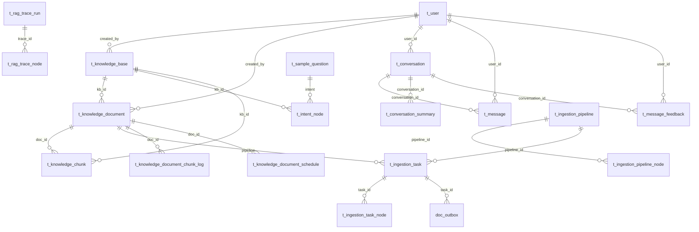
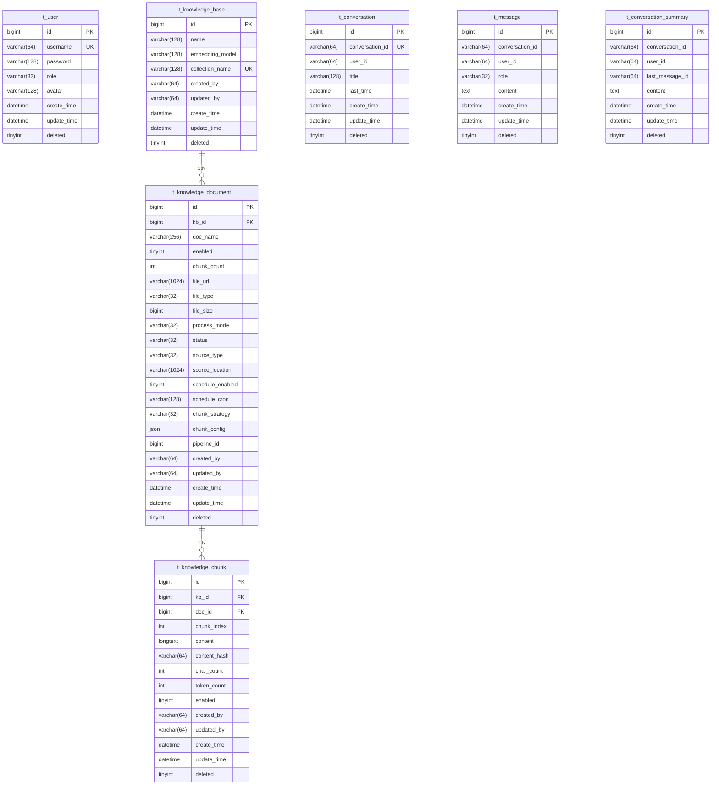

# ER 关系图

## 完整 ER 图



---

## 核心表关系



---

## 表清单

| 序号 | 表名 | 说明 | 关联表 |
|------|------|------|--------|
| 1 | t_user | 用户表 | t_knowledge_base, t_knowledge_document, t_conversation, t_message |
| 2 | t_knowledge_base | 知识库表 | t_knowledge_document, t_knowledge_chunk, t_intent_node |
| 3 | t_knowledge_document | 知识库文档表 | t_knowledge_chunk, t_ingestion_task, t_knowledge_document_schedule |
| 4 | t_knowledge_chunk | 知识库分块表 | - |
| 5 | t_conversation | 对话会话表 | t_message, t_conversation_summary, t_message_feedback |
| 6 | t_message | 对话消息表 | t_message_feedback |
| 7 | t_conversation_summary | 对话摘要表 | - |
| 8 | t_ingestion_pipeline | 摄入流水线表 | t_ingestion_pipeline_node, t_ingestion_task |
| 9 | t_ingestion_pipeline_node | 流水线节点定义表 | - |
| 10 | t_ingestion_task | 摄入任务表 | t_ingestion_task_node, doc_outbox |
| 11 | t_ingestion_task_node | 任务节点执行记录表 | - |
| 12 | t_message_feedback | 消息反馈表 | - |
| 13 | t_intent_node | 意图节点表 | - |
| 14 | t_sample_question | 示例问题表 | - |
| 15 | t_query_term_mapping | 查询词映射表 | - |
| 16 | t_rag_trace_run | RAG追踪运行表 | t_rag_trace_node |
| 17 | t_rag_trace_node | RAG追踪节点表 | - |
| 18 | doc_outbox | 文档处理异步消息表 | - |
| 19 | doc_processing_log | 文档处理日志表 | - |
| 20 | t_knowledge_document_chunk_log | 文档分块处理日志表 | - |
| 21 | t_knowledge_document_schedule | 文档定时调度配置表 | t_knowledge_document_schedule_exec |
| 22 | t_knowledge_document_schedule_exec | 文档定时调度执行记录表 | - |

---

## 设计亮点

### 1. 流水线模式 (Pipeline Pattern)

```
t_ingestion_pipeline
       │
       ▼
t_ingestion_pipeline_node (节点定义)
       │
       ▼
t_ingestion_task
       │
       ▼
t_ingestion_task_node (执行记录)
```

### 2. 全链路追踪

`t_rag_trace_run` + `t_rag_trace_node` 实现完整的 RAG 链路追踪：
- 支持嵌套节点（parent_node_id + depth）
- 记录每个节点的执行时间

### 3. 软删除模式

所有核心表都包含 `deleted` 字段，支持安全删除

---

*最后更新: 2026-04-10*
