# RAG系统架构设计文档

## 目录

1. [项目概述](#1-项目概述)
2. [技术选型与架构](#2-技术选型与架构)
3. [系统架构设计](#3-系统架构设计)
4. [核心模块设计](#4-核心模块设计)
5. [数据流设计](#5-数据流设计)
6. [设计模式应用](#6-设计模式应用)
7. [API接口设计](#7-api接口设计)
8. [安全设计](#8-安全设计)
9. [部署架构](#9-部署架构)
10. [关键技术实现细节](#10-关键技术实现细节)

---

## 1. 项目概述

### 1.1 项目背景

RAG（Retrieval-Augmented Generation，检索增强生成）是一种将大规模语言模型（LLM）与外部知识库相结合的技术架构。本项目（RAGDemo）是一个生产级别的RAG系统，提供智能问答、文档检索和知识库管理功能。

### 1.2 项目目标

- **智能问答**：基于私有知识库的智能问答系统
- **文档管理**：支持多种格式文档的上传、解析、索引
- **混合检索**：结合语义检索与关键词检索，提供精准的检索结果
- **对话记忆**：支持多轮对话，保持上下文连贯性
- **意图识别**：智能识别用户查询意图，路由到不同的处理流程
- **质量评估**：集成RAGAS评估指标，持续优化系统性能

### 1.3 项目规格

| 项目属性 | 说明 |
|---------|------|
| 框架版本 | Spring Boot 3.2.4 |
| Java版本 | Java 17 |
| LLM框架 | LangChain4J 0.36.0 |
| 向量数据库 | Milvus 2.6.6 |
| 全文搜索引擎 | Elasticsearch 8.15.0 |
| 消息队列 | Apache Kafka 3.7.0 |
| 对象存储 | MinIO |
| 关系数据库 | MySQL 8.4.0 |
| 缓存系统 | Redis 7 |

---

## 2. 技术选型与架构

### 2.1 技术选型理由

#### 2.1.1 Spring Boot 3.2.4

- 成熟的企业级开发框架
- 良好的生态系统和社区支持
- 内置依赖注入和面向切面编程
- 易于与各种中间件集成

#### 2.1.2 LangChain4J 0.36.0

- 专为Java生态设计的LLM集成框架
- 提供统一的API抽象，支持多种LLM提供商
- 内置RAG相关组件（Embedding、Retrieval等）
- 活跃的社区和持续更新

#### 2.1.3 Milvus 2.6.6

- 开源分布式向量数据库
- 支持HNSW、IVF等多种索引算法
- 高性能ANN（近似最近邻）检索
- 支持混合标量过滤

#### 2.1.4 Elasticsearch 8.15.0

- 成熟的全文搜索引擎
- BM25算法提供优秀的关键词匹配能力
- 分布式架构，高可用高扩展
- 丰富的查询DSL支持复杂检索场景

#### 2.1.5 Apache Kafka 3.7.0

- 高吞吐量分布式消息队列
- 支持消息持久化和回溯
- 易于扩展的分区和副本机制
- 成熟的事件流处理生态

### 2.2 架构风格

本项目采用**分层架构 + 事件驱动架构**的混合模式：

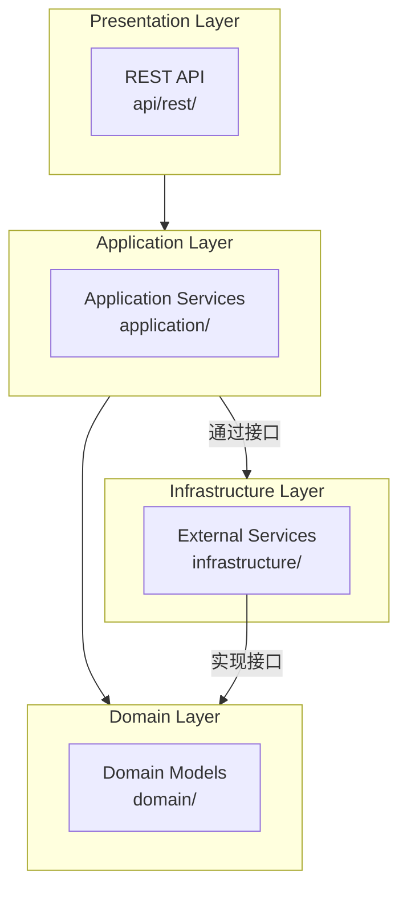

---

## 3. 系统架构设计

### 3.1 整体架构图

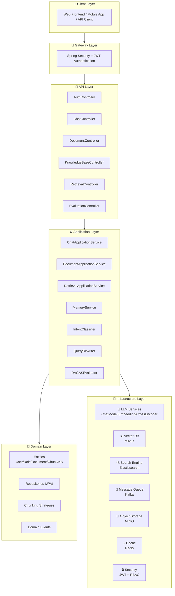

### 3.2 分层职责定义

| 层级 | 包路径 | 主要职责 | 关键类 |
|------|--------|----------|--------|
| **API层** | `api/rest/*` | HTTP请求处理、参数校验、响应封装 | Controllers |
| **应用层** | `application/*` | 业务编排、流程控制、事务协调 | ApplicationServices |
| **领域层** | `domain/*` | 业务规则、领域模型、事件定义 | Entities, Events, Strategies |
| **基础设施层** | `infrastructure/*` | 外部服务集成、技术实现 | LLM, VectorStore, Kafka |

### 3.3 模块依赖关系

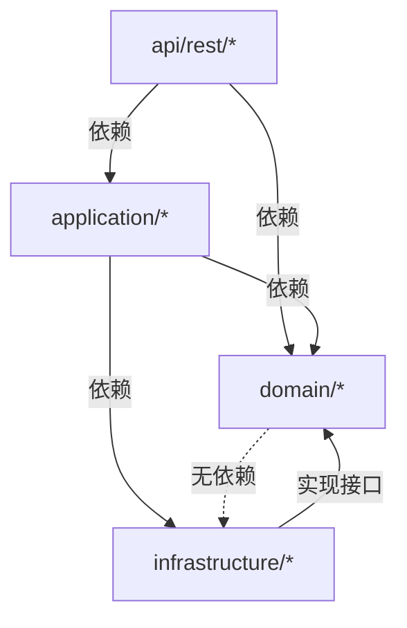

---

## 4. 核心模块设计

### 4.1 文档处理模块（Document Processing）

#### 4.1.1 模块职责

- 接收文档上传请求
- 解析多种格式的文档（PDF、Word、Markdown、HTML、TXT等）
- 文本分块处理
- 生成向量嵌入
- 索引到向量数据库和全文搜索引擎

#### 4.1.2 核心组件

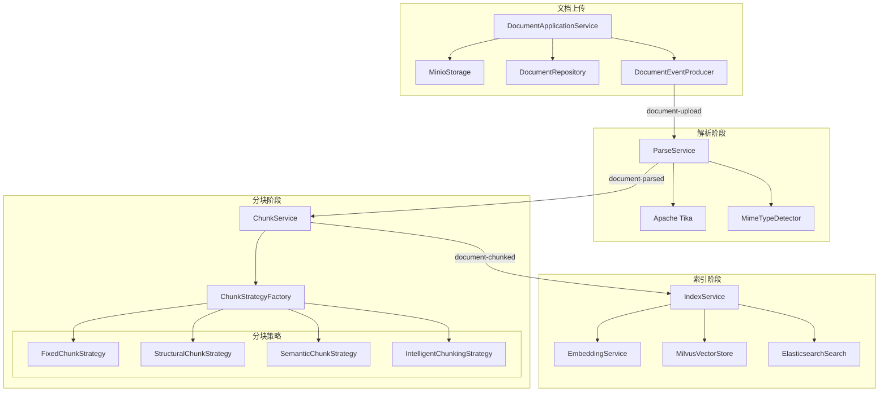

#### 4.1.3 文档状态机

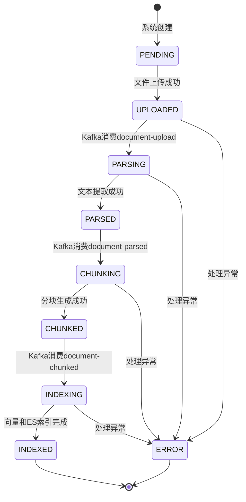

| 状态 | 说明 | 触发条件 |
|------|------|----------|
| PENDING | 初始状态 | 系统创建 |
| UPLOADED | 已上传到MinIO | 文件上传成功 |
| PARSING | 正在解析 | Kafka消费document-upload事件 |
| PARSED | 解析完成 | 文本提取成功 |
| CHUNKING | 正在分块 | Kafka消费document-parsed事件 |
| CHUNKED | 分块完成 | 分块生成成功 |
| INDEXING | 正在索引 | Kafka消费document-chunked事件 |
| INDEXED | 索引完成 | 向量和ES索引完成 |
| ERROR | 处理失败 | 任意阶段异常 |

### 4.2 检索模块（Retrieval）

#### 4.2.1 混合检索架构

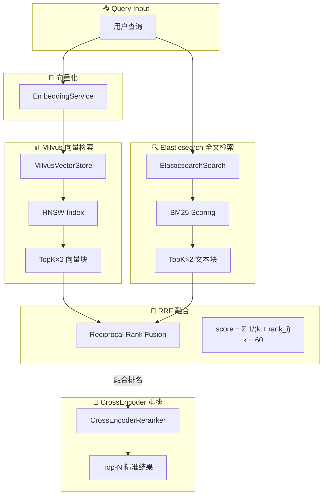

#### 4.2.2 RRF融合算法

Reciprocal Rank Fusion（倒数排名融合）是一种将多个检索结果进行融合的算法：

```java
public double calculateRRFScore(Map<String, Integer> ranks, int k) {
    double score = 0.0;
    for (Map.Entry<String, Integer> entry : ranks.entrySet()) {
        score += 1.0 / (k + entry.getValue());
    }
    return score;
}
```

**k值选择**：
- k值越小，排名靠前的结果权重越高
- k值越大，所有结果权重越均衡
- 本项目默认k=60，在精确度和召回率之间取得平衡

#### 4.2.3 CrossEncoder重排

使用双编码器（Bi-Encoder）近似CrossEncoder进行结果重排：

```java
public List<Chunk> rerank(List<Chunk> chunks, String query, int topN) {
    // 1. 计算每个chunk与query的余弦相似度
    // 2. 按相似度降序排序
    // 3. 返回Top-N结果
}
```

### 4.3 对话模块（Chat）

#### 4.3.1 对话流程

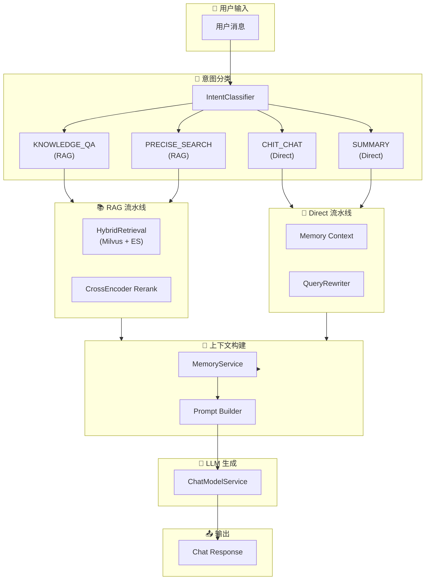

#### 4.3.2 意图分类器

IntentClassifier使用LLM进行零样本分类：

```json
{
  "intent": "KNOWLEDGE_QA",
  "confidence": 0.92,
  "reasoning": "User is asking a factual question about a specific topic that requires retrieving information from the knowledge base."
}
```

**支持的意图类型**：

| 意图 | 描述 | 处理流程 |
|------|------|----------|
| KNOWLEDGE_QA | 知识库问答 | 触发RAG检索流程 |
| CHIT_CHAT | 闲聊对话 | 直接生成回复 |
| PRECISE_SEARCH | 精确搜索 | 触发RAG检索流程 |
| SUMMARY | 摘要请求 | 使用记忆上下文 |
| UNKNOWN | 未分类 | 根据置信度决定 |

#### 4.3.3 查询改写器

QueryRewriter提供三种查询增强策略：

1. **Query Expansion**：使用同义词和相关术语扩展查询
2. **Query Decomposition**：将复杂问题分解为多个子问题
3. **HyDE（Hypothetical Document Embeddings）**：生成假设性答案文档用于检索

### 4.4 记忆模块（Memory）

#### 4.4.1 记忆存储架构

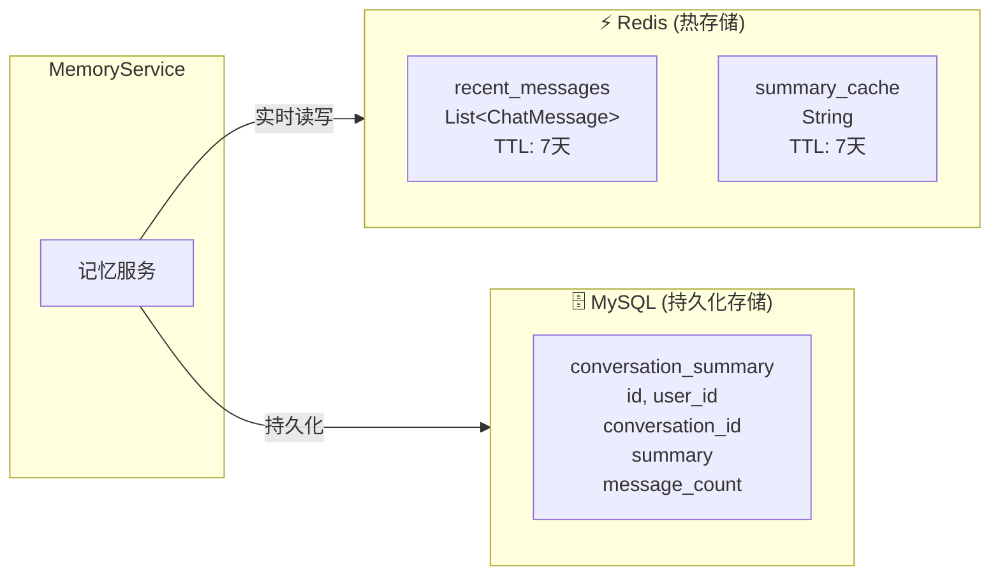

#### 4.4.2 滑动窗口机制

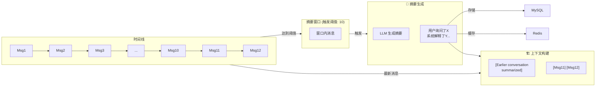

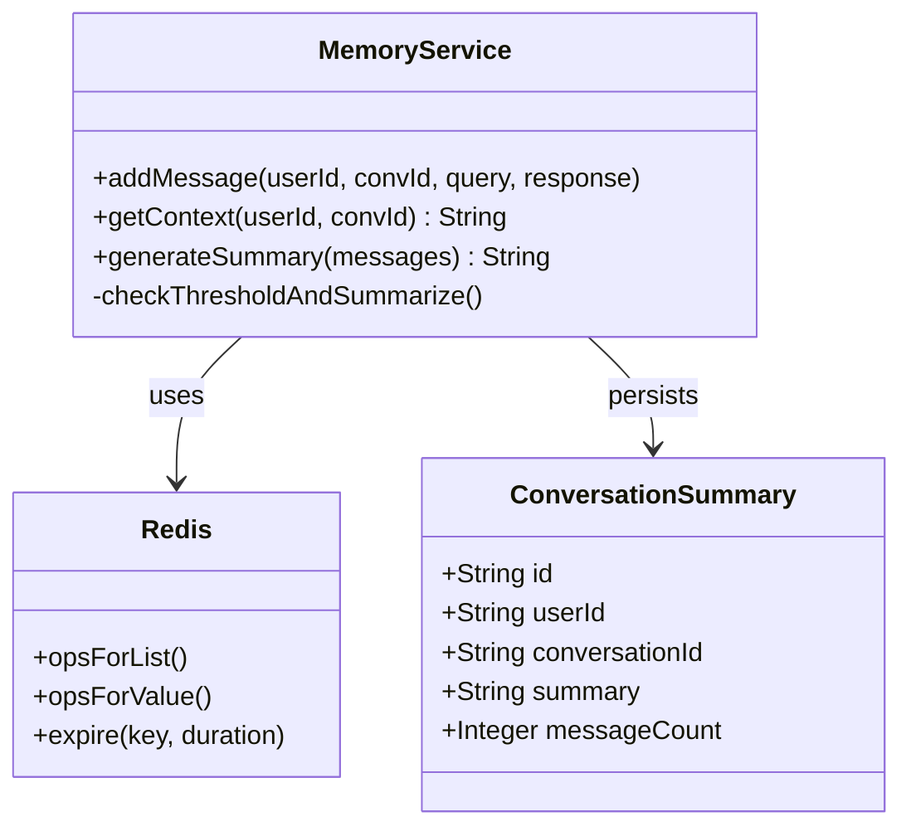

#### 4.4.3 记忆配置参数

| 参数 | 默认值 | 说明 |
|------|--------|------|
| window_size | 20 | Redis中保存的最近消息数 |
| summary_threshold | 10 | 触发摘要生成的消息数 |
| ttl_days | 7 | Redis缓存TTL（天） |
| summary_max_tokens | 500 | 摘要最大token数 |

### 4.5 评估模块（Evaluation）

#### 4.5.1 RAGAS指标

RAGAS（Retrieval-Augmented Generation Assessment）是一套用于评估RAG系统质量的指标体系：

| 指标 | 描述 | 计算方式 |
|------|------|----------|
| Faithfulness | 答案对上下文的忠诚度 | 答案中从上下文衍生的陈述比例 |
| Answer Relevancy | 答案与问题的相关性 | 答案embedding与问题embedding的相似度 |
| Context Precision | 上下文排序的精确度 | 相关块在排序中的位置权重 |
| Context Recall | 上下文的召回率 | 答案覆盖的ground truth比例 |

#### 4.5.2 评估流程

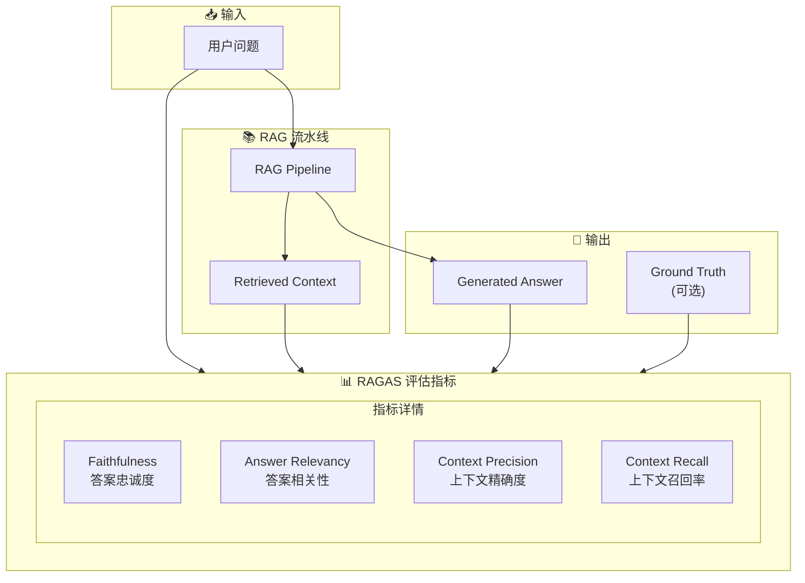

---

## 5. 数据流设计

### 5.1 文档上传完整数据流

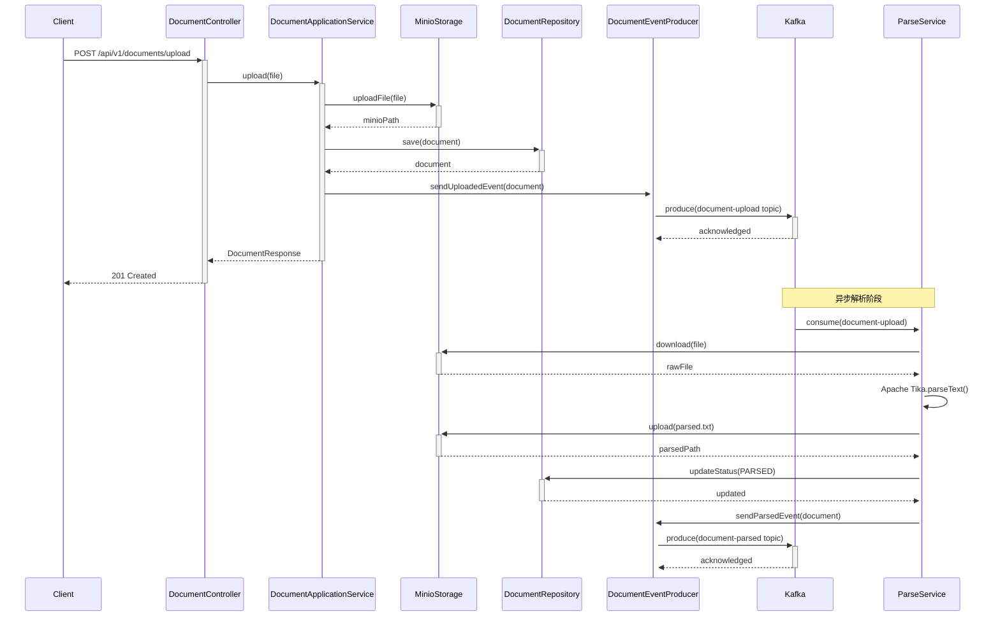

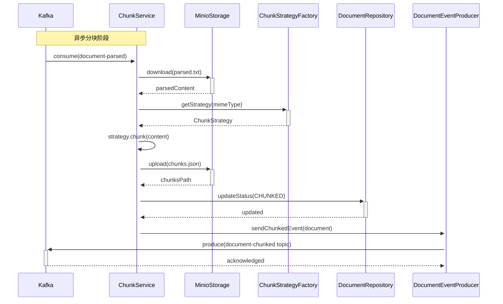

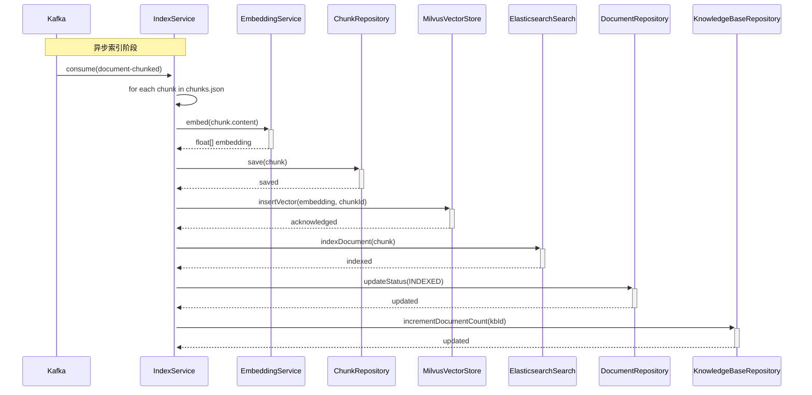

### 5.2 查询处理完整数据流

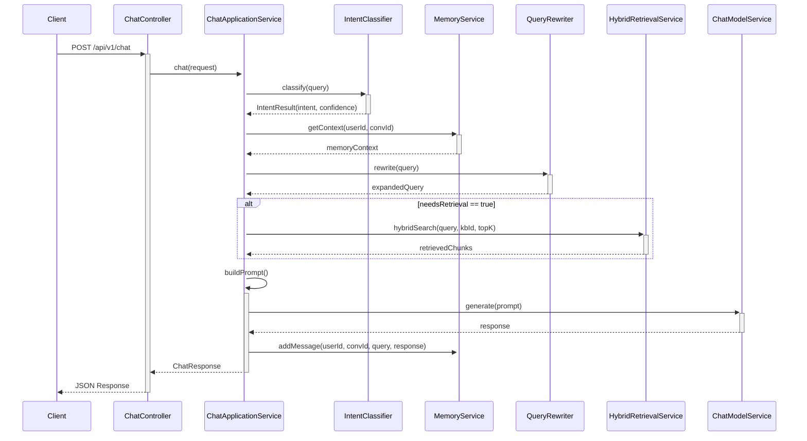

---

## 6. 设计模式应用

### 6.1 策略模式（Strategy Pattern）

#### 6.1.1 Chunking策略

**意图**：定义一系列分块算法，它们可以相互替换。

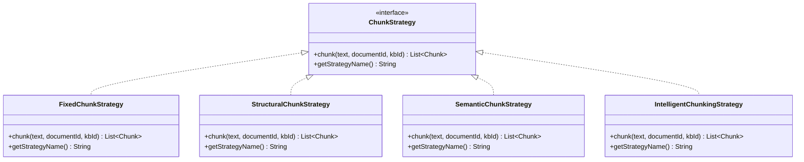

**实现细节**：

1. **FixedChunkStrategy**：固定字数分块
   - 按固定token数切分
   - 可配置重叠区域保持上下文连贯
   - 适合结构化文档

2. **StructuralChunkStrategy**：保持文档结构
   - 识别标题、段落、代码块
   - 以自然结构边界分块
   - 适合Markdown、HTML文档

3. **SemanticChunkStrategy**：语义分块
   - 句子级别分词
   - 语义相似性判断合并
   - 保持语义完整性

4. **IntelligentChunkingStrategy**：智能分块
   - 自动检测文档类型
   - 选择最优分块策略
   - 适合混合类型文档

**工厂类**：
```java
public class ChunkStrategyFactory {
    public ChunkStrategy getStrategy(String strategyName, String mimeType) {
        if (strategyName == null) {
            return new IntelligentChunkingStrategy();
        }
        return switch (strategyName.toLowerCase()) {
            case "fixed" -> new FixedChunkStrategy();
            case "structural" -> new StructuralChunkStrategy();
            case "semantic" -> new SemanticChunkStrategy();
            case "intelligent" -> new IntelligentChunkingStrategy();
            default -> new IntelligentChunkingStrategy();
        };
    }
}
```

### 6.2 工厂模式（Factory Pattern）

ChunkStrategyFactory、DocumentEventProducer等使用工厂模式创建对象。

### 6.3 观察者模式（Observer Pattern）

Kafka的Consumer/Producer模式本质上是一种观察者模式：
- Producer（Subject）发布事件
- Consumer（Observer）订阅并处理事件

### 6.4 模板方法模式（Template Method Pattern）

各Kafka Consumer服务处理流程类似：
```
consume() → validate() → process() → updateStatus() → publishNext()
```

### 6.5 门面模式（Facade Pattern）

ApplicationService作为门面，封装底层复杂逻辑：
- ChatApplicationService封装对话流程
- DocumentApplicationService封装文档处理流程

### 6.6 依赖注入（Dependency Injection）

通过Spring的IoC容器实现依赖注入：
```java
@Service
public class ChatApplicationService {
    private final ChatModelService chatModelService;
    private final MemoryService memoryService;
    private final IntentClassifier intentClassifier;
    private final HybridRetrievalService retrievalService;
    
    @Autowired
    public ChatApplicationService(
            ChatModelService chatModelService,
            MemoryService memoryService,
            IntentClassifier intentClassifier,
            HybridRetrievalService retrievalService) {
        this.chatModelService = chatModelService;
        this.memoryService = memoryService;
        this.intentClassifier = intentClassifier;
        this.retrievalService = retrievalService;
    }
}
```

---

## 7. API接口设计

### 7.1 认证接口（Auth）

| 方法 | 路径 | 描述 | 认证 |
|------|------|------|------|
| POST | `/api/v1/auth/register` | 用户注册 | 否 |
| POST | `/api/v1/auth/login` | 用户登录 | 否 |
| POST | `/api/v1/auth/refresh` | 刷新Token | 是 |

### 7.2 聊天接口（Chat）

| 方法 | 路径 | 描述 | 认证 |
|------|------|------|------|
| POST | `/api/v1/chat` | 发送消息 | 是 |
| GET | `/api/v1/chat/history/{conversationId}` | 获取历史 | 是 |
| DELETE | `/api/v1/chat/history/{conversationId}` | 删除会话 | 是 |

### 7.3 文档接口（Document）

| 方法 | 路径 | 描述 | 认证 |
|------|------|------|------|
| POST | `/api/v1/documents/upload` | 上传文档 | 是 |
| GET | `/api/v1/documents/{id}` | 获取文档信息 | 是 |
| GET | `/api/v1/documents/{id}/status` | 获取处理状态 | 是 |
| DELETE | `/api/v1/documents/{id}` | 删除文档 | 是 |
| GET | `/api/v1/documents` | 列出文档 | 是 |

### 7.4 知识库接口（KnowledgeBase）

| 方法 | 路径 | 描述 | 认证 |
|------|------|------|------|
| POST | `/api/v1/kbs` | 创建知识库 | 是 |
| GET | `/api/v1/kbs/{id}` | 获取知识库 | 是 |
| PUT | `/api/v1/kbs/{id}` | 更新知识库 | 是 |
| DELETE | `/api/v1/kbs/{id}` | 删除知识库 | 是 |
| GET | `/api/v1/kbs` | 列出知识库 | 是 |

### 7.5 检索接口（Retrieval）

| 方法 | 路径 | 描述 | 认证 |
|------|------|------|------|
| POST | `/api/v1/retrieve` | 检索文档 | 是 |

### 7.6 评估接口（Evaluation）

| 方法 | 路径 | 描述 | 认证 |
|------|------|------|------|
| POST | `/api/v1/evaluation/ragas` | RAGAS评估 | 是 |

---

## 8. 安全设计

### 8.1 认证机制

#### 8.1.1 JWT认证流程

```mermaid
flowchart TB
    subgraph Login["登录流程"]
        LClient["Client"] -->|POST /auth/login| LAuthC["AuthController"]
        LAuthC -->|generate| JWT["JWT Token"]
        JWT -->|返回| LClient
    end
    
    subgraph Request["后续请求"]
        RClient["Client"] -->|Request + Bearer Token| Req["HTTP Request"]
    end
    
    subgraph Filter["JWT Filter Chain"]
        Filter["JwtAuthenticationFilter"]
        Validate["JwtUtils.validateToken()"]
        Auth["SecurityContextHolder"]
    end
    
    subgraph Access["访问控制"]
        Controller["@PreAuthorize"]
    end
    
    Request --> Filter
    Filter --> Validate
    Validate --> Auth
    Auth --> Controller
```

#### 8.1.2 Token结构

```json
{
  "header": {
    "alg": "HS512",
    "typ": "JWT"
  },
  "payload": {
    "sub": "userId",
    "username": "admin",
    "role": "ROLE_ADMIN",
    "iat": 1712736000,
    "exp": 1712822400
  },
  "signature": "HMACSHA512(...)"
}
```

### 8.2 RBAC权限控制

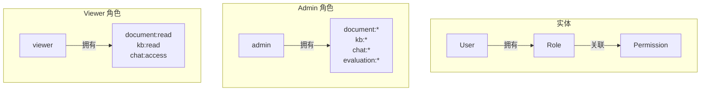

### 8.3 速率限制

使用Redis实现分布式限流：

```java
public class DistributedRateLimiter {
    public boolean tryAcquire(String key, int limit, Duration window) {
        String countKey = "rate_limit:" + key;
        Long current = redisTemplate.opsForValue().increment(countKey);
        if (current == 1) {
            redisTemplate.expire(countKey, window);
        }
        return current <= limit;
    }
}
```

---

## 9. 部署架构

### 9.1 Docker Compose架构

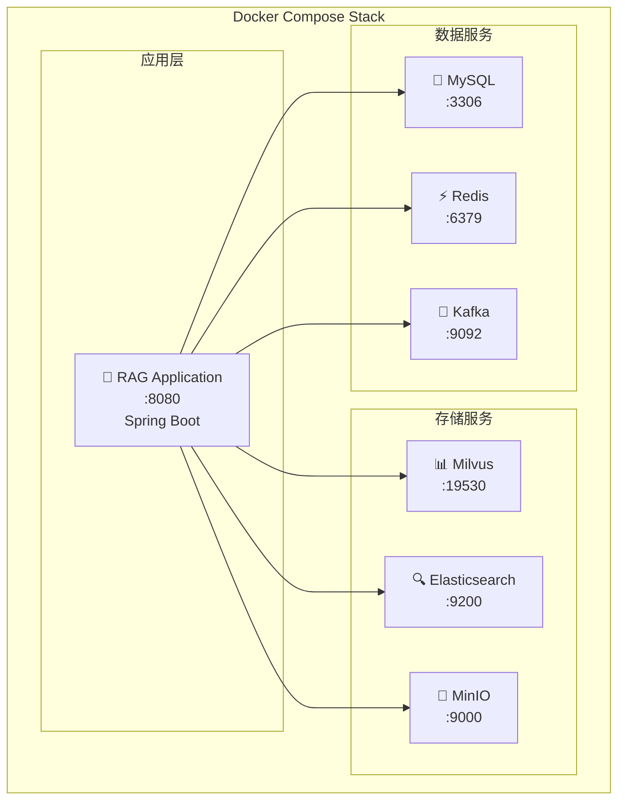

### 9.2 Kubernetes架构（生产环境）

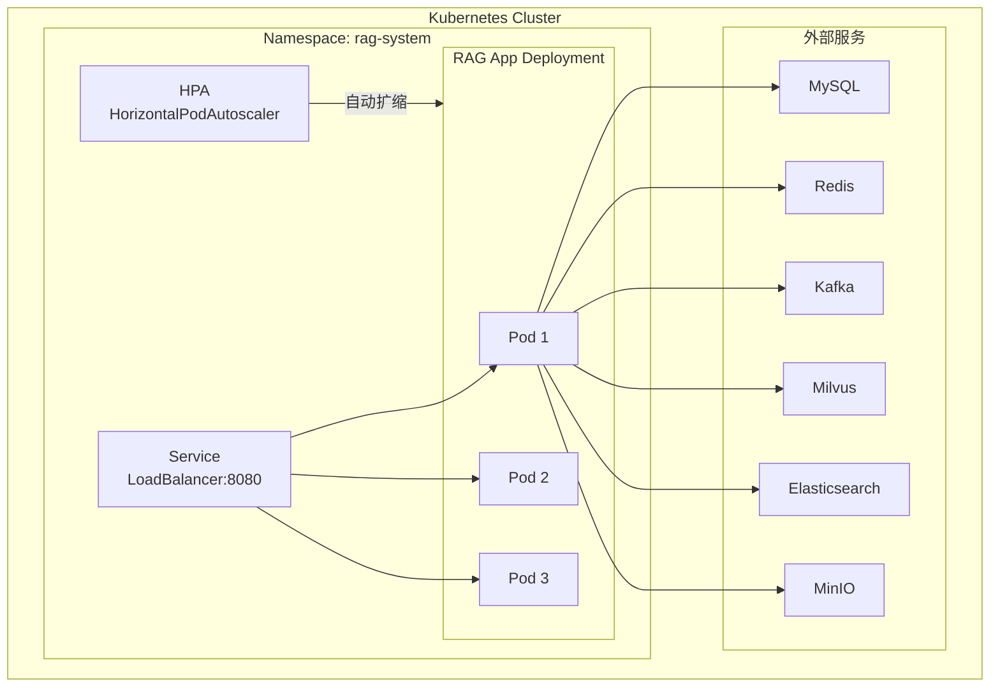

### 9.3 环境配置

| 环境 | 配置方式 | 说明 |
|------|----------|------|
| 开发环境 | `config.yaml` | 本地开发使用 |
| 测试环境 | 环境变量 | CI/CD自动注入 |
| 生产环境 | Kubernetes ConfigMap/Secret | 敏感信息加密存储 |

---

## 10. 关键技术实现细节

### 10.1 向量化实现

```java
@Service
public class EmbeddingService {
    
    @Value("${embedding.model}")
    private String model;
    
    @Value("${embedding.dimension}")
    private int dimension;
    
    public float[] embed(String text) {
        // 使用LangChain4j的Embedding模型
        EmbeddingModel embeddingModel = OpenAiEmbeddingModel.builder()
            .apiKey(apiKey)
            .model(model)
            .build();
        
        Content content = Content.from(text);
        Embedding embedding = embeddingModel.embed(content).content();
        
        return embedding.vectorAsList().stream()
            .map(Double::floatValue)
            .mapToFloat(Float::floatValue)
            .toArray();
    }
}
```

### 10.2 RRF融合实现

```java
public List<Chunk> rrfFusion(
        List<Chunk> milvusResults,
        List<Chunk> esResults,
        int k) {
    
    // 1. 为每个结果分配排名
    Map<String, Integer> milvusRank = new HashMap<>();
    for (int i = 0; i < milvusResults.size(); i++) {
        milvusRank.put(milvusResults.get(i).getId(), i + 1);
    }
    
    Map<String, Integer> esRank = new HashMap<>();
    for (int i = 0; i < esResults.size(); i++) {
        esRank.put(esResults.get(i).getId(), i + 1);
    }
    
    // 2. 计算RRF分数
    Map<String, Double> rrfScores = new HashMap<>();
    Set<String> allIds = new HashSet<>();
    allIds.addAll(milvusRank.keySet());
    allIds.addAll(esRank.keySet());
    
    for (String id : allIds) {
        double score = 0.0;
        if (milvusRank.containsKey(id)) {
            score += 1.0 / (k + milvusRank.get(id));
        }
        if (esRank.containsKey(id)) {
            score += 1.0 / (k + esRank.get(id));
        }
        rrfScores.put(id, score);
    }
    
    // 3. 按分数排序
    return rrfScores.entrySet().stream()
        .sorted((a, b) -> Double.compare(b.getValue(), a.getValue()))
        .map(e -> findChunkById(allIds, e.getKey()))
        .collect(Collectors.toList());
}
```

### 10.3 意图分类实现

```java
public IntentResult classify(String query) {
    String prompt = """
        Classify the intent of the following user query.
        
        Query: "%s"
        
        Choose one of:
        - KNOWLEDGE_QA: Factual questions requiring knowledge base retrieval
        - CHIT_CHAT: General conversation, greetings
        - PRECISE_SEARCH: Exact information lookup requests
        - SUMMARY: Requests for summarization
        - UNKNOWN: Cannot classify or multiple intents
        
        Respond in JSON format:
        {
            "intent": "...",
            "confidence": 0.0-1.0,
            "reasoning": "..."
        }
        """.formatted(query);
    
    String response = chatModelService.generate(prompt);
    
    // 解析JSON响应
    return parseIntentResponse(response);
}
```

### 10.4 记忆摘要实现

```java
public String generateSummary(List<ChatMessage> messages) {
    String conversation = messages.stream()
        .map(m -> m.getRole() + ": " + m.getContent())
        .collect(Collectors.joining("\n"));
    
    String prompt = """
        Summarize the following conversation concisely.
        Focus on:
        - Main topics discussed
        - Key information shared
        - User preferences or requirements
        
        Conversation:
        %s
        
        Provide a summary in 2-3 sentences:
        """.formatted(conversation);
    
    return chatModelService.generate(prompt);
}
```

---

## 附录

### A. 配置参数说明

| 配置项 | 默认值 | 说明 |
|--------|--------|------|
| `server.ip` | localhost | 服务IP |
| `llm.provider` | openai | LLM提供商 |
| `llm.model` | gpt-4 | LLM模型 |
| `llm.api-key` | - | API密钥 |
| `embedding.model` | text-embedding-ada-002 | Embedding模型 |
| `embedding.dimension` | 1536 | 向量维度 |
| `milvus.uri` | localhost:19530 | Milvus连接地址 |
| `elasticsearch.host` | localhost | ES主机 |
| `elasticsearch.port` | 9200 | ES端口 |
| `chunking.chunk-size` | 500 | 分块大小(token) |
| `chunking.chunk-overlap` | 50 | 分块重叠(token) |
| `memory.window-size` | 20 | 记忆窗口大小 |
| `memory.summary-threshold` | 10 | 摘要触发阈值 |
| `memory.ttl-days` | 7 | 记忆TTL(天) |

### B. 数据库表结构

**documents表**
```sql
CREATE TABLE documents (
    id VARCHAR(36) PRIMARY KEY,
    kb_id VARCHAR(36) NOT NULL,
    file_name VARCHAR(255) NOT NULL,
    file_type VARCHAR(100),
    minio_path VARCHAR(500),
    status VARCHAR(20) DEFAULT 'PENDING',
    chunk_count INT DEFAULT 0,
    metadata JSON,
    created_at TIMESTAMP DEFAULT CURRENT_TIMESTAMP,
    updated_at TIMESTAMP DEFAULT CURRENT_TIMESTAMP ON UPDATE CURRENT_TIMESTAMP,
    INDEX idx_kb_id (kb_id),
    INDEX idx_status (status)
);
```

**chunks表**
```sql
CREATE TABLE chunks (
    id VARCHAR(36) PRIMARY KEY,
    document_id VARCHAR(36) NOT NULL,
    content TEXT NOT NULL,
    token_count INT,
    chunk_index INT,
    metadata JSON,
    created_at TIMESTAMP DEFAULT CURRENT_TIMESTAMP,
    INDEX idx_document_id (document_id),
    FULLTEXT INDEX idx_content (content)
);
```

**conversation_summary表**
```sql
CREATE TABLE conversation_summary (
    id VARCHAR(36) PRIMARY KEY,
    user_id VARCHAR(36) NOT NULL,
    conversation_id VARCHAR(36) NOT NULL,
    summary TEXT,
    message_count INT,
    created_at TIMESTAMP DEFAULT CURRENT_TIMESTAMP,
    INDEX idx_user_conv (user_id, conversation_id)
);
```

### C. Kafka Topic配置

| Topic | Partitions | Retention | 用途 |
|-------|------------|-----------|------|
| document-upload | 3 | 7 days | 触发文档解析 |
| document-parsed | 3 | 7 days | 触发文档分块 |
| document-chunked | 3 | 7 days | 触发索引构建 |

---

*文档版本：1.0*  
*最后更新：2026-04-10*  
*作者：RAGDemo Team*
